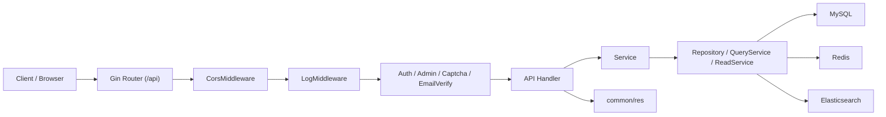
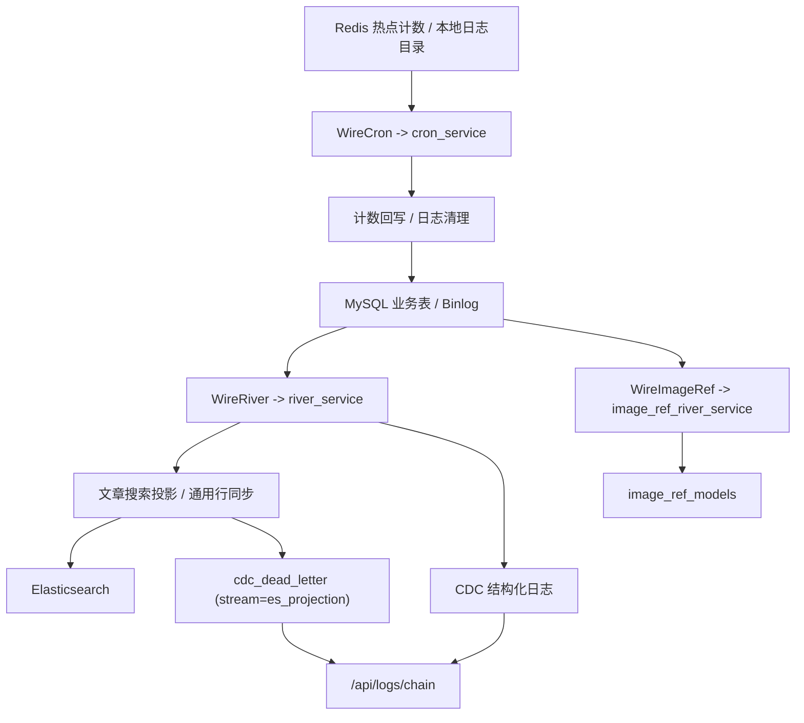

# 博客项目-后端开发-记录文档

**My blogweb project record documentation**

---

# 一、开发规范

## 1.1 Git 提交规范

提交信息遵循「类型(模块): 描述」格式，控制提交粒度，确保版本可追溯，具体规范如下：

| 提交类型 | 描述                       | 示例                               |
| -------- | -------------------------- | ---------------------------------- |
| feat     | 新增功能模块/核心能力      | feat(user): 实现QQ第三方登录       |
| fix      | 修复功能Bug                | fix(article): 解决文章编辑保存失败 |
| docs     | 文档/注释变更              | docs(api): 补充用户接口入参说明    |
| style    | 代码格式调整（不影响逻辑） | style: 统一代码缩进规范            |
| refactor | 代码重构（无新增/修复）    | refactor(log): 优化日志模块结构    |
| perf     | 性能优化                   | perf(cache): 优化Redis热点缓存策略 |
| test     | 测试相关操作               | test(user): 补充登录接口测试用例   |
| build    | 构建/依赖变更              | build: 更新GORM依赖版本            |
| ci       | 持续集成配置变更           | ci: 调整Docker Compose部署脚本     |
| chore    | 辅助工具/配置变更          | chore: 新增配置脱敏模板            |
| revert   | 版本回退                   | revert: 回退feat(user)提交版本     |

## 1.2 目录结构规范

遵循Go标准布局，分层设计，明确职责边界，核心目录说明如下：

| 核心目录               | 子文件/示例                     | 核心职责                         |
| ---------------------- | ------------------------------- | -------------------------------- |
| core/                  | init_cfg.go、init_db.go         | 核心组件（配置、数据库等）初始化 |
| flags/                 | enter.go                        | 命令行参数解析与多环境配置加载   |
| conf/                  | conf_db.go、conf_jwt.go         | 配置结构体定义，与YAML文件映射   |
| app/                   | bootstrap.go、wiring_http.go    | 启动装配、依赖注入与多角色运行   |
| apideps/               | deps.go                         | API 与中间件可见的显式依赖定义   |
| api/                   | user_api/、article_api/         | HTTP接口定义、参数解析与响应封装 |
| service/               | user_service/、email_service/   | 封装核心业务逻辑                 |
| models/                | user_model.go、article_model.go | 数据库表结构与ORM映射            |
| middleware/            | auth_middleware.go              | 认证、日志、跨域等横切逻辑       |
| utils/                 | ip/、cache/、encrypt/           | 通用工具函数封装                 |
| common/                | res/、constant/                 | 统一响应、常量、错误码定义       |
| init/                  | ipbase/、deploy/                | 初始化资源（IP库、部署配置）     |
| logs/、test/、uploads/ | -                               | 日志输出、测试文件、文件上传存储 |

当前仓库除了业务目录外，还多了一层 monorepo 工具层，主要负责统一调度前端、管理端和后端开发命令：

| 工具层路径 | 作用 |
| ---------- | ---- |
| `turbo.json` | Turborepo 任务编排、缓存策略与环境变量透传配置 |
| `pnpm-workspace.yaml` | workspace 范围定义，声明当前 monorepo 里有哪些包 |
| 根目录 `package.json` | monorepo 统一脚本入口，开发者优先从这里发起 `dev/build/test` |
| `apps/*/package.json` | 子应用任务定义，供 Turborepo 调用 |
| `apps/api/run-go-task.cjs` | Go 子项目在 pnpm / Turborepo 下的启动、构建、测试包装脚本 |

## 1.3 配置文件读取规范

### 1.3.1 基础规范

采用YAML格式，主文件为settings.yaml，按环境拆分（dev/prod），按模块分级配置，敏感信息仅存本地，不提交Git。

### 1.3.2 读取流程

1. 通过flags/enter.go解析命令行，指定配置文件；

2. core/init_cfg.go读取配置并校验；

3. 映射为conf/结构体实例；

4. 交给 `app.Bootstrap(...)` 组装为 `Infra`，再由 `Wire*` 显式下发给 HTTP、worker 和 CLI。

如果是通过根目录的 `pnpm dev:*`、`pnpm build:*`、`pnpm test` 这类命令启动，当前会经过 Turborepo 调度。由于 Turborepo 默认会限制任务可见的环境变量，仓库已经在 `turbo.json` 中显式透传 `BLOGX_*` 与 `TZ`；本地开发仍建议优先通过 `direnv exec . ...` 或正确安装 `direnv hook` 的 shell 来启动，避免子进程拿不到配置变量。

### 1.3.3 VS Code调试配置

编辑launch.json，添加启动参数避免重复输入，示例：

```json
{
  "version": "0.2.0",
  "configurations": [
    {
      "name": "Launch MyBlogX",
      "type": "go",
      "request": "launch",
      "mode": "auto",
      "program": "${workspaceFolder}/apps/api/cmd/server/main.go",
      "cwd": "${workspaceFolder}/apps/api",
      "args": ["-f", "config/settings.yaml", "--role=api"]
    }
  ]
}
```

按 F5 从 `apps/api/cmd/server/main.go` 启动，禁止用 Code Runner 直接运行入口文件。

## 1.4 接口设计规范

### 1.4.1 RESTful API标准

以资源为核心，通过HTTP方法定义操作，规范如下：

1. 资源用名词（复数），禁用动词，全小写短横线分隔；

2. 层级体现资源从属（如/articles/123/comments）；

3. 过滤/分页用查询参数（如?page=1&sort=created_at）；

4. 非资源操作例外（如/login、/tokens/refresh）。

| HTTP方法 | 操作     | 示例       | 说明                      |
| -------- | -------- | ---------- | ------------------------- |
| GET      | 集合查询 | /users     | 获取用户列表（分页/筛选） |
| GET      | 单体查询 | /users/123 | 获取ID=123的用户详情      |
| POST     | 创建     | /users     | 新增用户                  |
| PUT      | 全量更新 | /users/123 | 全量替换用户信息          |
| PATCH    | 部分更新 | /users/123 | 更新部分字段              |
| DELETE   | 删除     | /users/123 | 删除用户                  |

### 1.4.2 统一响应封装

common/res包统一封装响应体，提供标准化工具函数，禁止自定义返回格式，核心定义：

```go
type Response struct {
	Code Code   `json:"code"` // 业务状态码
	Data any    `json:"data"` // 响应数据
	Msg  string `json:"msg"`  // 提示信息
}

// 核心工具函数（示例）
func Ok(data any, msg string, c *gin.Context)
func FailWithMsg(msg string, c *gin.Context)
```

### 1.4.3 通用能力

实现ListQuery[T any]泛型分页查询；

### 1.4.4 接口文档

用ApiFox管理接口，上线前集成Swagger文档。

# 二、环境准备

本章只回答一个问题：如何基于当前仓库，把后端开发环境或单机部署环境稳定拉起来。内容以仓库现状为准，不再沿用旧版 `init/deploy` 路径和泛教程式说明。

## 2.1 环境目标与依赖

### 2.1.1 推荐使用场景

| 场景 | 适用阶段 | 目标 |
| ---- | -------- | ---- |
| 本地后端开发 | 日常开发、调试 API | 拉起 MySQL / Redis / ES / ClickHouse 等基础设施，单独运行 `apps/api` |
| 本地全栈联调 | 联调 web / admin / api | 在本地同时运行 `apps/web`、`apps/admin`、`apps/api` |
| 单机 / 云服务器部署 | 测试环境、个人部署 | 使用 `deploy/compose/local/docker-compose.yml` 一次性拉起整套服务 |

### 2.1.2 当前仓库依赖清单

| 类别 | 当前依据 | 说明 |
| ---- | -------- | ---- |
| Go | `apps/api/go.mod` 中为 `1.25.1` | 后端开发与构建必需 |
| Node.js + pnpm + Turborepo | 根目录 `package.json`、`turbo.json`、`apps/web/package.json`、`apps/admin/package.json` | 前端、管理端与 monorepo 任务调度需要；当前建议 Node `>=20.12.0`，根脚本统一通过 `turbo run` 调度 |
| Docker + Docker Compose Plugin | `deploy/compose/local/docker-compose.yml` | 本地基础设施与单机部署的主入口 |
| MySQL 5.7 | `mysql:5.7` | 主从结构，业务主库 |
| Redis 7.4.7 | `redis:7.4.7` | 缓存、验证码、会话、计数器 |
| Elasticsearch 7.12.0 | `myblogx-elasticsearch:7.12.0` | 文章搜索 |
| ClickHouse 25.3 | `clickhouse/clickhouse-server:25.3` | 日志查询库 |
| Fluent Bit 3.2 | `fluent/fluent-bit:3.2` | 把本地 JSON 日志采集到 ClickHouse |
| APIFox / Swagger | 文档与调试工具 | 可选，但推荐保留 |
| direnv | `.envrc.example` | 可选，用来统一加载环境变量 |

### 2.1.3 与环境相关的核心目录

| 路径 | 作用 |
| ---- | ---- |
| `deploy/compose/local/docker-compose.yml` | 当前本地 / 单机部署的 Compose 主入口 |
| `deploy/docker/` | 各组件 Dockerfile 与静态配置 |
| `deploy/state/` | 宿主机持久化目录，容器数据都挂这里 |
| `apps/api/config/settings.yaml` | 后端基础设施配置，绝大多数字段来自环境变量 |
| `apps/api/config/site_default_settings.yaml` | 站点默认运行时配置 |
| `.envrc.example` | 环境变量模板，Compose 与后端进程都会复用 |
| `turbo.json` | Turborepo 任务编排入口，定义 `dev/build/test/lint` 等任务行为 |
| `pnpm-workspace.yaml` | 当前 monorepo 的 workspace 包清单 |
| `apps/api/run-go-task.cjs` | 给 Go 子项目补齐 pnpm / Turborepo 运行环境的包装脚本 |
| `apps/api/cmd/server/main.go` | API 服务启动入口 |
| 根目录 `package.json` | monorepo 统一启动脚本入口 |

## 2.2 本地开发启动

### 2.2.0 monorepo 开发入口约定

当前仓库已经接入 Turborepo，根目录命令不再只是简单转发，而是由 `turbo run` 统一调度：

- `pnpm dev:web` / `pnpm dev:admin` / `pnpm dev:api`：启动单个应用的开发服务；
- `pnpm dev:all`：并发启动 `web`、`admin`、`api` 三个开发服务；
- `pnpm build`：统一触发 workspace 内各应用的构建；
- `pnpm test`：当前默认聚焦后端 `api` 测试；
- `pnpm lint`：按各包是否存在 `lint` 脚本选择性执行。

Turborepo 只负责 monorepo 任务编排，不改变 Compose、Go 命令模式或生产部署链路。也就是说，`apps/api` 的数据库迁移、ES 初始化、Compose 启动方式仍按原有后端设计执行。

### 2.2.1 最小启动链路

如果只做后端开发，推荐按下面顺序执行：

1. 复制环境变量模板并填入真实值：

   ```bash
   cp .envrc.example .envrc
   ```

   Windows PowerShell 可用：

   ```powershell
   Copy-Item .envrc.example .envrc
   ```

2. 准备 Node.js / pnpm 开发环境。

   当前前端使用 Nuxt 4，建议 Node 版本至少为 `20.12.0`，更推荐直接使用 Node 22 LTS。根 `package.json` 已声明 `engines.node >= 20.12.0`，低于该版本时，Nuxt 开发服务可能会直接报错。

3. 安装依赖：

   ```bash
   pnpm install
   ```

4. 加载环境变量。推荐使用 `direnv`：

   ```bash
   direnv allow
   ```

   如果暂时不用 `direnv`，也可以手动把 `.envrc` 中的变量导入当前 shell。

5. 启动本地基础设施：

   ```bash
   cd deploy/compose/local
   docker compose up -d
   ```

6. 本地直接运行 `apps/api` 时，首次启动前先手动初始化数据库与 ES：

   ```bash
   cd apps/api
   go run ./cmd/server --db
   go run ./cmd/server --es --s ensure
   ```

   如果你是通过 local Compose 启动 `blogx_server`，当前默认不是直接执行 `-t run -s init`，而是先进入容器入口脚本：

   ```bash
   /bin/sh /app/entrypoint.sh
   ```

   入口脚本会在真正启动 `/app/server -f config/settings.yaml -role=all` 之前做一次“首启自检”：

   - 用业务账号检查 `runtime_site_config_models` 是否存在；
   - 如果表不存在，则自动执行 `/app/server -db`；
   - 然后等待 ES 至少到 `yellow`，再执行 `/app/server -es -s ensure`；
   - 如果数据库已经初始化完成，则直接启动服务，不再重复跑迁移。

   这样做的原因是：当前 `-t run -s init` 属于后端 CLI 能力，而 local Compose 更需要“按真实库状态决定是否初始化”的首启策略。两者目标接近，但职责边界不同。

   `--es --s init` 仍然保留，但更适合手工重建索引 / pipeline 时使用，不适合作为无人值守首启命令。

   如果本地已有文章数据，需要补一次 ES 全量同步：

   ```bash
   go run ./cmd/server --es --s article-sync
   ```

5. 启动后端服务：

   ```bash
   go run ./cmd/server
   ```

   或在仓库根目录直接运行：

   ```bash
   pnpm dev:api
   ```

### 2.2.2 前后端联调命令

如果需要把前端、管理端、后端一起联调，推荐直接走根目录统一入口：

```bash
pnpm install
direnv allow
direnv exec . pnpm dev:all
```

其中：

- `web` 默认开发端口为 `3000`；
- `admin` 默认开发端口为 `3001`；
- `api` 端口仍读取 `apps/api/config/settings.yaml` 中展开后的 `BLOGX_APP_PORT`。

如果只想启动其中一个应用，也可以按需执行：

```bash
pnpm dev:web
pnpm dev:admin
pnpm dev:api
```

### 2.2.3 常用开发命令

| 命令 | 位置 | 作用 |
| ---- | ---- | ---- |
| `pnpm dev:all` | 仓库根目录 | 并发启动 `web`、`admin`、`api` 三个开发服务 |
| `pnpm dev:api` | 仓库根目录 | 启动后端开发服务 |
| `pnpm dev:web` | 仓库根目录 | 启动前台开发服务 |
| `pnpm dev:admin` | 仓库根目录 | 启动管理端开发服务 |
| `pnpm build` | 仓库根目录 | 通过 Turborepo 统一触发各应用构建 |
| `pnpm build:web` | 仓库根目录 | 只构建前台应用 |
| `pnpm build:admin` | 仓库根目录 | 只构建管理端应用 |
| `pnpm build:api` | 仓库根目录 | 只构建后端应用 |
| `pnpm test` | 仓库根目录 | 通过 Turborepo 触发后端测试 |
| `go test ./...` | `apps/api` | 运行后端测试 |
| `go run ./cmd/server --db` | `apps/api` | 执行数据库迁移 |
| `go run ./cmd/server --es --s ensure` | `apps/api` | 非交互确保 ES 索引与 pipeline 存在 |
| `go run ./cmd/server --es --s init` | `apps/api` | 交互式重建 ES 索引与 pipeline |
| `go run ./cmd/server --es --s article-sync` | `apps/api` | 全量同步文章到 ES |
| `go run ./cmd/server -t run -s init` | `apps/api` | 一键完成安全初始化后继续启动服务 |
| `docker compose ps` | `deploy/compose/local` | 查看容器状态 |
| `docker compose logs -f 服务名` | `deploy/compose/local` | 跟踪单个服务日志 |

## 2.3 Compose 部署结构

### 2.3.1 当前 Compose 默认服务

| 服务名 | 镜像 / 来源 | 作用 |
| ------ | ----------- | ---- |
| `mysql-master` | `mysql:5.7` | MySQL 主库 |
| `mysql-slave` | `mysql:5.7` | MySQL 从库 |
| `redis` | `redis:7.4.7` | 缓存与计数器 |
| `es` | `deploy/docker/es/Dockerfile` | Elasticsearch + IK 分词器 |
| `clickhouse` | `clickhouse/clickhouse-server:25.3` | 日志查询存储 |
| `blogx_server` | `deploy/docker/api/Dockerfile` | 后端 API 服务 |
| `fluent-bit` | `fluent/fluent-bit:3.2` | 采集日志到 ClickHouse |
| `nginx` | `nginx:latest` | 对外静态站点与反向代理入口 |
| `kafka` | 已注释 | 当前 Compose 默认不启用 |

### 2.3.2 目录职责

当前部署目录应按下面理解：

- `deploy/compose/local/`
  - 只放 Compose 入口文件。
- `deploy/docker/`
  - 放各组件配置与 Dockerfile，例如 MySQL、Redis、ES、Fluent Bit、Nginx。
- `deploy/state/`
  - 放持久化数据，例如 MySQL 数据目录、Redis 数据目录、ES 数据目录、API 日志目录。

### 2.3.3 配置加载关系

当前配置链路是：

1. shell 环境变量；
2. `docker-compose.yml` 和 `apps/api/config/settings.yaml` 同时读取这些变量；
3. `apps/api` 启动后把变量解析成 `conf.Config`，再按 `InitInfra -> flags.Run -> InitRuntimeServices` 顺序完成基础设施与运行时服务装配；
4. 站点展示类默认值再由 `site_default_settings.yaml` 与数据库中的运行时配置共同决定。

也就是说，这个仓库的环境配置核心不是 `.env` 文件，而是“先把环境变量注入 shell，再启动 Compose 或 Go 进程”。

在当前 Compose 中，`blogx_server` 还有两层运行时约束：

- 容器启动前会先等待 ES 健康检查至少到 `yellow`；
- Compose 通过 `entrypoint.sh + command` 组合启动：入口脚本先按数据库真实状态决定是否执行 `-db` 与 `--es --s ensure`，随后再运行 `/app/server -f config/settings.yaml -role=all`。

## 2.4 服务器准备

### 2.4.1 推荐基础环境

| 项目 | 建议 |
| ---- | ---- |
| 操作系统 | Ubuntu 22.04 LTS |
| 资源规格 | 至少 `2C4G`，更推荐 `4C8G` |
| 网络 | 22 端口供 SSH，80/443 供站点访问；数据库与中间件端口尽量只开内网 |
| 登录方式 | 推荐 SSH 密钥登录 |

资源建议偏高的主要原因不是 Go 服务本身，而是 Elasticsearch、ClickHouse、MySQL 主从同时运行时会明显吃内存。

### 2.4.2 服务器初始化建议

建议只保留以下最关键准备项：

1. 安装 Docker Engine 与 Docker Compose Plugin。
2. 配置 SSH 密钥登录，减少密码登录暴露面。
3. 若使用公网服务器，先配安全组 / 防火墙，再开放必要端口。
4. 若需要远程编辑文件，优先用 VS Code Remote SSH；SFTP 仅作为可选同步手段，不再作为主流程依赖。

### 2.4.3 宿主机内核参数

为了兼容 ES 和 Redis，宿主机建议设置：

```bash
echo 'vm.max_map_count=262144' | sudo tee /etc/sysctl.d/99-blogx.conf
echo 'vm.overcommit_memory=1' | sudo tee -a /etc/sysctl.d/99-blogx.conf
sudo sysctl --system
```

- `vm.max_map_count=262144`
  - 给 Elasticsearch 用，避免 mmap 数量不够。
- `vm.overcommit_memory=1`
  - 给 Redis 的 fork / 持久化链路留出更宽松的内存分配策略。

### 2.4.4 服务器启动方式

把仓库同步到服务器后，典型启动命令就是：

```bash
cd /path/to/blogx_monorepo/deploy/compose/local
docker compose up -d
docker compose ps
```

如果只想看某个服务：

```bash
docker compose logs -f blogx_server
docker compose logs -f mysql-master
docker compose logs -f es
```

## 2.5 关键配置与注意事项

### 2.5.1 需要优先确认的配置项

在 `.envrc` 中，至少要确认这些字段已经改成真实值：

- `BLOGX_DB_*`
- `BLOGX_REDIS_*`
- `BLOGX_ES_*`
- `BLOGX_CLICKHOUSE_*`
- `BLOGX_JWT_*`
- `BLOGX_SMTP_*`
- `BLOGX_QINIU_*`
- `BLOGX_QQ_*`
- `BLOGX_AI_*`

如果这些值没有先配好，后端虽然能编译，但登录、上传、搜索、日志查询、AI 能力都会出现部分不可用。

### 2.5.2 当前仓库里的几个真实边界

这部分很重要，都是当前仓库里已经存在的实现边界：

1. `docker-compose.yml` 没有单独引用 `.env` 文件。
   - 也就是说，Compose 依赖当前 shell 已经有环境变量。
   - 如果直接开新终端执行 `docker compose up -d`，很可能会出现变量为空的问题。

2. MySQL / Redis / Fluent Bit 这批部署配置都依赖环境变量，但读取方式已经不完全相同。
   - MySQL 主从初始化脚本会从环境变量读取业务账号、复制账号和密码。
   - Redis 仍采用“模板 + 启动时渲染”的方式生成最终配置。
   - Fluent Bit 已改为直接在配置文件里使用 `${BLOGX_CLICKHOUSE_*}` 环境变量展开，不再依赖额外渲染脚本。
   - 因此如果直接在一个没加载 `.envrc` 的终端里执行 `docker compose up -d`，仍然会出现空变量问题。

3. Kafka 目前只是预留。
   - Compose 里保留了 Kafka 片段，但默认注释掉，不属于当前最小可运行环境。

4. `nginx` 当前是静态站点容器兼反向代理入口。
   - 它不会自动构建 `apps/web` 和 `apps/admin`。
   - 前端产物如果要进入 Nginx，需要单独构建并放到对应目录。

5. 当前前端开发环境依赖 Nuxt 4，对 Node 版本有明确要求。
   - 本地联调建议直接使用 Node `20.12.0+`，更推荐 Node 22 LTS。
   - 如果使用 Node 18 一类较低版本，Nuxt CLI 可能会在启动阶段因为 Node 内置 API 不兼容而直接报错。

6. 当前仓库通过 Turborepo 从根目录统一启动子应用时，会显式透传 `BLOGX_*` 与 `TZ`。
   - 这解决了 `apps/api` 在 `turbo run dev` 下读取不到环境变量的问题。
   - 但前提仍是 `.envrc` 已真正加载进当前 shell，或命令通过 `direnv exec . ...` 启动。

7. `web` 与 `admin` 在并发开发时需要独立端口。
   - 当前仓库已固定 `web` 开发端口为 `3000`、`admin` 为 `3001`。
   - 同时也为两边分配了不同的开发期 WebSocket / HMR 端口，避免并发启动时互相抢占。

8. Compose 网络现在使用 Docker 默认桥接网络分配，不再依赖固定子网和静态 IP。
   - 服务间通信应使用服务名，例如 `mysql-master`、`redis`、`blogx_server`，而不是写死容器 IP。

### 2.5.3 组件安全建议

- MySQL、Redis、Elasticsearch、ClickHouse 不建议直接暴露公网。
- Elasticsearch 当前已开启内置认证，但这不等于可以无条件开放 9200 端口。
- Redis 配置了密码，但依然应尽量只开放内网访问。
- 日志采集链路依赖 Fluent Bit 读取宿主机挂载目录，因此不要随意改变 API 日志挂载路径。

## 2.6 排查顺序

环境起不来时，优先按这个顺序查：

1. 看环境变量有没有真的加载：

   ```bash
   echo $BLOGX_DB_NAME
   echo $BLOGX_ES_PASSWORD
   ```

2. 看容器是否健康：

   ```bash
   cd deploy/compose/local
   docker compose ps
   ```

3. 看后端是否能连通基础设施：

   ```bash
   docker compose logs -f blogx_server
   ```

4. 看 ES、MySQL、ClickHouse 自身日志：

   ```bash
   docker compose logs -f es
   docker compose logs -f mysql-master
   docker compose logs -f clickhouse
   ```

5. 看健康检查口是否能通：

   ```bash
   curl http://127.0.0.1:8080/health
   ```

   这里推荐使用 `/health` 而不是业务接口 `/api/site/ai_info`。`/health` 只表示 HTTP 主循环仍然存活，不检查下游依赖，也不会写入 Gin access log 或 runtime 请求日志。

# 三、数据结构

本项目的数据层不是“所有内容都放一套表”，而是按职责拆成四层：MySQL 负责业务事实数据，Redis 负责短期状态与实时冗余，Elasticsearch 负责文章搜索副本，ClickHouse 负责结构化日志查询。接口实现通常遵循“先写 MySQL 主数据，再补 Redis 冗余；搜索和日志走专用存储”的路径。

## 3.1 存储分层总览

| 存储层 | 主要载体 | 负责内容 | 在接口实现中的作用 |
| --- | --- | --- | --- |
| MySQL | `models/*.go` | 用户、文章、评论、收藏、消息、图片、会话等业务事实数据 | 绝大多数写接口和后台管理接口都以它为准 |
| Redis | `service/redis_service/*` | 实时计数、判重、验证码、黑名单、上传任务、聊天限流 | 承担高频状态读写，减少重复计算和瞬时并发压力 |
| Elasticsearch | `ArticleModel` 的 `Mapping/Pipeline` | 文章全文检索副本、分词字段、搜索摘要字段 | 搜索接口和 AI 检索增强依赖它，而不是直接扫 MySQL |
| ClickHouse | `log_service` 结构化日志表 | 运行日志、登录事件、操作审计 | 后台日志查询与统计分析走它，避免 OLTP 库承接分析型查询 |

这四层里，只有 MySQL 是核心业务数据源；Redis、ES、ClickHouse 都是围绕性能、检索或分析能力构建的辅助存储。

## 3.2 MySQL 核心模型

| 业务域 | 核心模型 | 关键字段 / 关系 | 实现要点 |
| --- | --- | --- | --- |
| 基础模型 | `Model` | `id`、`created_at`、`updated_at`、`deleted_at` | 主业务表统一继承雪花 ID 和软删除语义，接口层可以用同一套主键风格处理资源 |
| 用户与认证 | `UserModel`、`UserConfModel`、`UserStatModel`、`UserSessionModel`、`UserFollowModel`、`UserViewDailyModel` | `username/email/open_id` 唯一，`token_version`，`refresh_token_hash`，关注关系复合唯一 | 用户创建后自动补齐配置表和统计表；`UserStatModel` 当前冗余维护主页访问、粉丝、关注、文章总数、文章累计阅读数；登录会话落 MySQL，不靠 Redis 持久化 |
| 文章内容 | `ArticleModel`、`CategoryModel`、`TagModel`、`ArticleTagModel`、`UserTopArticleModel` | `author_id`、`category_id`、`status`、文章与标签多对多 | 文章正文在 MySQL，分类按用户隔离，标签是公共词库，搜索副本另存 ES |
| 互动行为 | `ArticleDiggModel`、`FavoriteModel`、`UserArticleFavorModel`、`UserArticleViewHistoryModel`、`CommentModel`、`CommentDiggModel` | 点赞/收藏关系复合唯一，`favor_id`，评论 `reply_id` 与 `root_id` | 点赞、收藏、评论都用关系表记录事实，再配合冗余计数字段支撑列表展示 |
| 图片与引用 | `ImageModel`、`ImageRefModel` | `object_key`、`hash` 唯一，`ref_type/owner_id/field/position` 复合唯一 | 图片先沉淀为正式资源，再绑定到文章封面、正文图片等业务对象，避免业务表直接持有上传过程状态 |
| 站点与运营 | `RuntimeSiteConfigModel`、`BannerModel` | `name` 唯一，`show`、`cover`、`href` | 运行时可修改的站点配置和首页运营位单独存储，不和部署配置混在一起 |
| 消息通知 | `ArticleMessageModel`、`GlobalNotifModel`、`UserGlobalNotifModel` | `receiver_id`，`msg_id/user_id` 复合唯一 | 文章互动消息直接按用户落站内信；全局通知拆成“通知内容”和“用户已读状态”两层 |
| 私聊会话 | `ChatSessionModel`、`ChatMsgModel`、`ChatMsgUserStateModel` | `session_id`、`clear_before_msg_id`、`unread_count`、`msg_id/user_id` 复合唯一 | 会话按用户各存一份，消息共享同一个 `session_id`，本地删除等用户态单独记录 |

## 3.3 关键关联与设计思路

- 用户注册成功后，`UserModel.AfterCreate` 会自动创建 `UserConfModel` 和 `UserStatModel`，这样后续接口可以默认认为“用户配置”和“主页统计”始终存在，不需要在每个读取接口里补兜底逻辑。
- `UserStatModel` 当前维护的字段包括：`view_count`、`fans_count`、`follow_count`、`article_count`、`article_visited_count`。其中 `article_count` 与 `article_visited_count` 通过文章创建、文章访问、文章删除链路增量维护，删除时会做下限保护，避免统计被减成负数。
- 登录态采用 `UserSessionModel + token_version + Redis JWT 黑名单` 组合实现：会话事实落 MySQL，Redis 只保存短期失效状态与安全辅助信息，因此“踢下线”“单设备失效”“刷新令牌续签”都能围绕单条会话记录展开。
- 文章域把“正文”“分类”“标签”“置顶”拆成独立模型：`ArticleModel` 保存主内容，`CategoryModel` 表示用户私有分类，`TagModel + ArticleTagModel` 维护公共标签词库和文章关系，既利于后台管理，也方便搜索索引同步。
- 评论域采用 `reply_id + root_id` 双字段设计：`reply_id` 表示直接回复谁，`root_id` 表示属于哪棵一级评论树，这样一级评论列表、楼中楼回复列表、回复数统计都能用相对稳定的查询方式实现。
- 收藏不是简单的“文章-用户”二元关系，而是 `FavoriteModel + UserArticleFavorModel` 两层结构，表示“收藏夹”与“收藏动作”分离，所以一个用户可以维护多个收藏夹，接口也能支持批量归类和独立管理。
- 站内消息区分两种来源：文章互动走 `ArticleMessageModel`，全局公告走 `GlobalNotifModel + UserGlobalNotifModel`。这样做的好处是互动消息天然和业务对象强绑定，而全局消息可以一条内容面向多用户发放，并单独记录已读状态。
- 私聊采用“一条消息流、两份会话视图”的设计。`ChatMsgModel` 是共享消息流，`ChatSessionModel` 则按用户各存一份未读数、清空位置、置顶和静音状态，以换取用户侧列表查询和状态更新的简单性。
- 图片资源采用“资源表 + 引用表”拆分。上传成功后先落 `ImageModel`，业务对象保存成功后再写 `ImageRefModel`，避免文章、站点配置、轮播图等业务模块重复管理对象存储元数据。

## 3.4 Redis 键空间

| 类别 | 典型 Key | 类型 | 生命周期 | 用途 |
| --- | --- | --- | --- | --- |
| 文章实时计数 | `article_view`、`article_digg`、`article_favorite`、`article_comment` | Hash | 无固定 TTL | 字段为 `article_id`，把浏览、点赞、收藏、评论增量叠加到文章基础值上 |
| 评论实时计数 | `comment_reply`、`comment_digg` | Hash | 无固定 TTL | 字段为 `comment_id`，用于评论回复数和点赞数的实时回写 |
| 标签与站点统计 | `tag_article_count`、`blog_site_flow:total`、`blog_site_flow:daily` | Hash / String | 日流量保留近 30 天 | 保存标签文章数、站点总流量和最近天数流量曲线 |
| 浏览判重 | `user_history_{user_id}`、`guest_history_{hash}`、`user:view:daily:{date}:{user_id}` | Hash | 到次日 00:00 | 控制文章浏览量、用户主页访问量的日级去重 |
| 认证与安全 | `email_verify:{id}`、`auth:email:send:*`、`auth:login:fail:*`、`auth:login:lock:*`、`token_blacklist_{token}`、`seq:user:username` | Hash / String | 按窗口、按 token 有效期或长期保留 | 验证码一次性消费、邮件发送限频、登录失败锁定、JWT 黑名单、自动用户名序列 |
| 图片上传任务 | `image:upload:task:id:*`、`image:upload:task:object:*`、`image:upload:task:lock:*`、`image:audit:*` | String | 分钟级到 24 小时 | 暂存上传任务、回调反查任务、分布式锁、审核回调先到时的兜底状态 |
| 聊天短期状态 | `chat:rate:user:*`、`chat:rate:session:*`、`chat:quota:week:*`、`chat:ws:ticket:*` | ZSet / String | 120 秒、自然周、短票据 TTL | 处理分钟限流、陌生人周配额、WebSocket 一次性鉴权票据 |

Redis 在这里的角色不是“替代数据库”，而是为接口链路补充实时计数、判重和短期状态。绝大部分业务事实仍然以 MySQL 为准。

## 3.5 当前实现边界

- 当前没有独立的 `roles`、`permissions` 关系表，权限控制主要依赖 `UserModel.Role` 枚举和中间件判断，所以旧式 RBAC 表结构不属于现阶段实现范围。
- 当前也没有 `user:session:{user_id}` 这类 Redis 会话结构。登录态事实数据在 `UserSessionModel`，Redis 只参与黑名单、限流、验证码和短期状态控制。
- `GuestArticleViewRecordModel` 仍保留在代码里，但当前主迁移链并未纳入这张表；访客阅读去重的主实现仍然是 Redis `guest_history_*`。
- 文章搜索依赖单独初始化 ES 索引并执行 `--es --s article-sync` 同步，因此它不是“写入 MySQL 后立即强一致可搜”的模型。
- ClickHouse 只负责日志查询与统计，不参与业务主链路；如果部署时未启用 ClickHouse，相关日志分析能力会降级，但不会影响核心内容接口。
- Redis 中多数 key 都是辅助冗余，理论上可以回填或重建；但自动用户名生成、图片上传任务暂存、聊天限流和 WebSocket 票据等流程会直接依赖 Redis 可用性，这部分不能简单视作“纯缓存”。


# 五、功能性需求

## 5.2 功能总览

### 功能说明

当前后端已经形成三层能力面：

- 公共内容面：站点配置、轮播图、文章、评论、搜索等公开读接口。
- 用户交互面：登录认证、资料维护、收藏点赞、消息、关注、私信、AI 辅助等登录态接口。
- 运营与支撑面：日志、图片资源、全局通知、统计、定时同步、CLI、全局资源初始化等后台或内部能力。

### 接口设计表

| 领域 | 路由前缀 / 入口 | 主要能力 | 权限 |
| ---- | --------------- | -------- | ---- |
| 站点与展示 | `/api/site`、`/api/banners` | 站点运行时配置读取、轮播图展示 | 公开读，管理员写 |
| 内容中心 | `/api/articles`、`/api/comments` | 文章 CRUD、审核、互动、评论 | 公开读，登录写，部分管理员专用 |
| 用户中心 | `/api/users`、`/api/imagecaptcha` | 验证码、登录注册、会话、资料 | 公开入口 + 登录态操作 |
| 消息与社交 | `/api/sitemsg`、`/api/chat`、<br />`/api/follow`、`/api/fans`、<br />`/api/global_notif` | 通知、关注、私信、WebSocket | 以登录态为主，部分管理员入口 |
| 搜索与 AI | `/api/search`、`/api/ai` | ES 搜索、AI 提取 / 评分 / 改写 / 搜索分析 | 搜索公开，AI 需登录 |
| 运营后台 | `/api/logs`、`/api/data`、<br />`/api/images` | 日志查询、统计汇总、图片资源管理 | 管理员 |
| 内部运行能力 | `flags/*`、`app/*`、<br />`service/cron_service` | 命令模式、启动装配、worker 调度与缓存回写 | 内部 / CLI |

### 设计思路

- 对外统一从 `router/enter.go` 进入，按路由前缀映射到具体 router，再分发到 `api -> service -> model / redis / es / clickhouse`。
- 公开读接口和登录写接口在路由层就做分组，减少每个 handler 内部重复判断权限。
- 热点计数优先走 Redis 增量，MySQL 保持权威数据，ES 负责检索，ClickHouse 负责日志查询，职责边界比较清晰。

### 当前实现边界

- 目前没有把所有模块都暴露成同等完备的管理后台，有些能力只有前台接口或内部入口。
- 一部分能力已经有 service 和模型，但仍属于内部支撑，不应理解为稳定对外 API。
- 文档这里给的是“能力地图”，具体字段与异常分支需要回到对应模块小节查看。

## 5.3 通用接口约定

### 功能说明

所有 HTTP 模块共享同一套请求绑定、统一响应、鉴权中间件和分页约定，这部分决定了各业务接口的写法会比较一致。

### 接口设计表

| 约定项 | 当前实现 |
| ------ | -------- |
| 路由入口 | 所有 HTTP 接口统一挂到 `/api` |
| 参数绑定 | 使用 `BindQuery[T]`、`BindJson[T]`、`BindUri[T]` |
| 统一响应 | 使用 `common/res` 返回 `{code,data,msg}` |
| 鉴权 | `AuthMiddleware` 校验访问令牌，`AdminMiddleware` 追加管理员权限 |
| 验证辅助 | `CaptchaMiddleware` 负责图形验证码，`EmailVerifyMiddleware` 负责邮箱验证码 |
| 分页 | 后台准确数据页可返回 `count`；前台/公开列表默认使用 `has_more`，简单列表用 `common.ListQueryHasMore`，复杂列表用 `common.PageIDHasMoreQuery` |
| 审计采集 | 需要记录原始请求/响应时通过 `CaptureLog(...)` 显式开启 |
| 可选登录态 | 某些公开接口通过 `MustAuthenticateAccessTokenByGin` 读取可选用户身份 |

### 设计思路

- 中间件先做参数和权限兜底，handler 只处理业务判断与调用 service，代码层次更清晰。
- 后台准确数据页可以保留 `count`；非后台准确数据页优先返回 `has_more`，避免把热点列表绑死在 `count(*)` 上。
- 列表查询优先走 `ListQuery` / `ListQueryHasMore` 复用通用分页、模糊搜索、预加载；当 join、排序、预加载同时存在时，再退回两段查询或专用 query service。
- 审计日志不是默认采集所有请求体，而是只对敏感接口显式开启，避免无意义放大日志体积和风险。

### 当前实现边界

- `common/cursor_query.go` 已有 TODO，当前主流程仍以页码分页为主。
- 评论、文章流这类热点读路径，已经开始优先走 `has_more + 专用查询`，不再强行塞进统一 `count` 分页模型。
- 可选登录态接口的“已登录 / 未登录”差异逻辑由业务代码自己收口，不是统一约束。
- CORS 当前仍偏开发友好策略，域名白名单没有做成完整配置化能力。

## 5.4 站点配置

### 功能说明

站点配置模块负责提供前台可读的站点信息，以及后台可修改的运行时配置。它的核心价值不是改 `settings.yaml`，而是把运行中真正生效的 `Site` / `AI` 配置落到数据库并同步到内存。

### 接口设计表

| 接口 | 方法 | 权限 | 说明 |
| ---- | ---- | ---- | ---- |
| `/api/site/qq_url` | GET | 公开 | 返回 QQ 登录跳转地址 |
| `/api/site/seo` | GET | 公开 | 返回 SEO 摘要字段 |
| `/api/site/ai_info` | GET | 公开 | 返回前台可见的 AI 展示信息 |
| `/api/site/:name` | GET | 公开 | 读取运行时配置片段，当前主要用于 `site`、`seo` |
| `/api/site/admin/:name` | GET | 管理员 | 读取完整运行时配置片段，当前支持 `site`、`ai` |
| `/api/site/:name` | PUT | 管理员 | 更新 `site` 或 `ai` 的运行时配置 |

### 设计思路

- 启动时 `site_service.InitRuntimeConfig()` 会从数据库读取 `runtime_site_config_model`，没有记录时再从 `site_default_settings.yaml` 灌入默认值。
- 运行时配置分成 `Site` 和 `AI` 两块，更新时先写库，再刷新 `RuntimeConfigService` 持有的生效配置镜像，避免请求侧读到旧值。
- 管理员读取 `ai` 配置时会对 `secret_key` 做占位处理，写回时若仍是占位符则保留旧值，避免后台编辑时误清空密钥。
- `runtime_site_config_models` 这张表依赖数据库迁移创建；如果跳过初始化直接启动服务，运行时配置加载会失败。

### 当前实现边界

- 当前只有一份名为 `default` 的运行时配置，不支持多站点、多环境并行切换。
- 更新粒度仍是“整块配置覆盖”，没有做字段级 patch、历史版本或回滚记录。
- 公开读取口只暴露当前用到的片段，不等于前台能获取全部运行时配置。
- 代码现在会在缺少 `runtime_site_config_models` 时给出明确错误提示，提示先执行数据库初始化，而不是只抛裸 SQL 缺表异常。

## 5.5 图片资源

### 功能说明

图片模块负责“上传任务创建 -> 云端上传 -> 服务端确认 -> 后台管理”整条链路。它不是传统的直接传文件到本机，而是围绕七牛对象存储和去重任务来设计。

### 接口设计表

| 接口 | 方法 | 权限 | 说明 |
| ---- | ---- | ---- | ---- |
| `/api/images/upload-tasks` | POST | 登录 | 创建图片上传任务，返回上传凭证或秒传结果 |
| `/api/images/upload-tasks/complete` | POST | 登录 | 前端手动确认上传完成 |
| `/api/images/upload-tasks/:id` | GET | 登录 | 轮询上传任务状态 |
| `/api/images/qiniu/callback` | POST | 内部回调 | 七牛上传完成回调 |
| `/api/images/qiniu/audit/callback` | POST | 内部回调 | 七牛审核结果回调 |
| `/api/images` | GET | 管理员 | 分页查看图片资源 |
| `/api/images` | DELETE | 管理员 | 删除图片、云端对象和图片引用关系 |

### 设计思路

- 创建任务时先校验大小、MIME、后缀白名单和内容哈希；若数据库里已存在同 hash 图片，则直接走秒传返回，不再重复上传。
- 上传任务存 Redis，真正上传到七牛；前端可主动调用 `complete`，也可依赖七牛回调触发确认。
- 确认阶段使用分布式锁防并发重复确认，再根据七牛对象的 hash、大小、宽高等元信息做二次校验，最后事务性写入 `image_models`。
- 后台删除会同时删除七牛对象，并清理 `image_ref_river_service` 维护的引用关系，避免业务记录还指向已删图片。
- 当前推荐把“用户头像上传”视为图片上传任务链路的一个业务场景：前端先复用 `/api/images/upload-tasks` 创建上传任务，上传确认后再把返回的图片 URL 写回 `/api/users/info.avatar`，而不是为头像上传单独发明一套完全不同的直传流程。

### 当前实现边界

- 当前只支持图片资源，且存储提供方只落地了七牛。
- 上传任务状态主要保存在 Redis，而不是数据库表；进程外排障需要同时看缓存和图片表。
- 审核回调是异步补充链路，审核状态未必和上传确认同一时刻完成。
- 当前契约层已经允许把上传任务复用于用户头像场景，但后端还没有单独的 `/api/users/avatar` 一类专用头像上传接口；如果后续需要更强的头像裁剪、尺寸约束或安全策略，可以在现有上传任务链路之外，再单独提供用户头像上传接口。

## 5.6 轮播图

### 功能说明

轮播图模块是最轻量的展示配置模块，负责维护首页轮播资源，数据模型只有封面图、跳转链接和展示开关。

### 接口设计表

| 接口 | 方法 | 权限 | 说明 |
| ---- | ---- | ---- | ---- |
| `/api/banners` | GET | 公开 | 分页查询轮播图，可按 `show` 过滤 |
| `/api/banners` | POST | 管理员 | 创建轮播图 |
| `/api/banners/:id` | PUT | 管理员 | 更新轮播图 |
| `/api/banners` | DELETE | 管理员 | 批量删除轮播图 |

### 设计思路

- 轮播图直接落库在 `banner_models`，没有额外 service 抽象，属于典型的轻量配置型 CRUD。
- 管理端写接口统一挂审计日志，便于后续追踪谁改了展示资源。
- 图片字段只保存 URL，不在轮播图模块里重复管理上传能力，资源来源统一复用图片模块。

### 当前实现边界

- 当前没有独立排序字段，展示顺序主要取决于列表默认排序与前端使用方式。
- 没有定时上下线、投放范围、渠道配置等运营能力。
- 轮播图和图片资源之间没有强约束外键，更多依赖业务侧保持 URL 有效。

## 5.7 认证与会话

### 功能说明

认证模块负责验证码、登录注册、密码找回、邮箱绑定、令牌刷新和会话失效控制。这里的核心不是“发一个 JWT”就结束，而是把用户状态、会话状态和 Redis 黑名单串起来做完整校验。

### 接口设计表

| 接口 | 方法 | 权限 | 说明 |
| ---- | ---- | ---- | ---- |
| `/api/imagecaptcha` | GET | 公开 | 获取图形验证码 |
| `/api/users/email/verify` | POST | 公开 | 发送邮箱验证码，受图形验证码与频控保护 |
| `/api/users/email/login` | POST | 公开 | 邮箱验证码登录 |
| `/api/users/email/register` | POST | 公开 | 邮箱注册 |
| `/api/users/qq` | POST | 公开 | QQ 登录 |
| `/api/users/login` | POST | 公开 | 账号密码登录 |
| `/api/users/refresh` | POST | 公开 | 使用刷新令牌换新访问令牌 |
| `/api/users/password/recovery/email` | PUT | 公开 | 邮箱找回密码 |
| `/api/users/password/renewal/email` | PUT | 登录 | 已登录用户修改密码 |
| `/api/users/logout` | POST | 登录 | 注销当前会话 |
| `/api/users/logout/all` | POST | 登录 | 注销当前用户全部会话 |
| `/api/users/email/bind` | PUT | 登录 | 绑定邮箱 |
| `/api/users/sessions` | GET | 登录 | 获取当前用户仍然有效的会话列表 |
| `/api/users/sessions/:id` | DELETE | 登录 | 按会话 ID 精确下线指定设备 |

### 设计思路

- 图形验证码通过 HTTP 启动阶段注入的 `ImageCaptchaStore` 校验，邮箱验证码通过 Redis 存储并配合 `EmailVerifyMiddleware` 在后续登录 / 注册 / 绑定流程中复用。
- 登录成功后由 `user_service.CreateLoginTokens` 统一生成访问令牌、刷新令牌和会话记录；刷新令牌放 Cookie，访问令牌走响应体。
- `AuthMiddleware` 最终会走到 `AuthenticateAccessToken`：解析 JWT -> 校验 Redis 黑名单 -> 校验用户状态与 token version -> 校验 `user_session_models` 是否有效。
- `logout` / `logout/all` 不只是删前端 token，而是把对应会话吊销，并利用 token version / 黑名单实现立刻失效。
- `/api/users/sessions` 与 `/api/users/login/log` 现在职责拆开：前者返回真实会话资源，服务“当前设备管理 / 下线设备”；后者继续保留登录事件日志语义，服务审计与回溯。
- 会话吊销现在以 `revoked_at` 作为失效判定主依据，不再把 `refresh_token_hash` 统一清成空字符串，避免唯一索引在多设备下线时发生冲突。

### 当前实现边界

- 当前认证入口是图形验证码、邮箱、密码、QQ 四类，没有更完整的 OAuth 平台矩阵。
- 图形验证码存储默认走进程内内存，天然不适合多实例共享场景。
- 当前会话管理已经支持“列出自己仍有效的设备会话”和“按会话 ID 精确下线”；但它仍聚焦用户自助安全管理，不包含管理员视角的全站设备管控。

## 5.8 用户资料与后台用户管理

### 功能说明

这一块负责用户自己的资料维护、登录日志查询，以及管理员查看用户列表、修改用户资料等后台能力。

### 接口设计表

| 接口 | 方法 | 权限 | 说明 |
| ---- | ---- | ---- | ---- |
| `/api/users/detail` | GET | 登录 | 获取当前用户完整资料与用户配置 |
| `/api/users/base` | GET | 登录 | 获取指定用户基础信息，并返回主页聚合统计 |
| `/api/users/info` | PUT | 登录 | 更新当前用户资料和用户配置 |
| `/api/users/admin/info` | PUT | 管理员 | 管理员修改用户资料 |
| `/api/users/login/log` | GET | 登录 | 查看自己的登录日志 |
| `/api/users/admin/list` | GET | 管理员 | 查看后台用户列表 |

### 设计思路

- 用户信息拆成 `user_models` 与 `user_conf_models` 两张表，资料更新时会把请求字段分别映射到两个模型中落库。
- 用户偏好标签现在按“ID 写入、明细读取”收口：更新资料时优先提交 `like_tag_ids`，详情接口返回 `like_tag_ids + like_tag_items`；旧字段 `like_tags` 只保留兼容入参，不再作为详情展示字段继续扩散。
- 用户名修改有唯一性校验和冷却期控制，避免用户频繁改名造成识别混乱。
- 管理员用户列表会补拉 ClickHouse 中最近一次成功登录记录，给后台展示最后登录时间、IP 和归属地。

### 当前实现边界

- 当前 `base` 接口仍要求登录后访问，并不是完全公开的用户主页接口。
- `/api/users/base` 当前已不是简单的“昵称 + 头像”接口，还会返回 `view_count`、`fans_count`、`follow_count`、`article_count`、`article_visited_count` 等主页聚合统计，便于前端个人主页首屏一次拿齐展示数据。
- 最近登录页如果要支持“下线设备”，前端应优先对接 `/api/users/sessions`，而不是继续把登录事件日志 `/api/users/login/log` 当成可操作的会话数据源。
- 用户头像字段 `avatar` 当前建议复用图片上传任务链路产出的图片 URL 写回；也就是说，用户资料接口本身负责持久化头像地址，但不负责直传文件。如果后续引入独立头像上传接口，应把它视为对现有资料更新链路的增强，而不是替代用户资料更新接口本身。
- 后台用户管理还比较轻，主要是列表查看和资料修改，没有成体系的封禁、审核、批量运营动作。
- 用户画像能力目前更多停留在基础资料和偏好标签层，没有独立推荐档案模块。

## 5.9 日志

### 功能说明

日志模块包含三类日志：运行日志、登录事件日志、操作审计日志。写入链路和查询链路刻意拆开，避免在线请求直接依赖分析型存储。

### 接口设计表

| 接口 | 方法 | 权限 | 说明 |
| ---- | ---- | ---- | ---- |
| `/api/logs/runtime` | GET | 管理员 | 分页查询运行日志 |
| `/api/logs/runtime/:id` | GET | 管理员 | 查询运行日志详情 |
| `/api/logs/login` | GET | 管理员 | 分页查询登录事件日志 |
| `/api/logs/login/:id` | GET | 管理员 | 查询登录事件详情 |
| `/api/logs/action` | GET | 管理员 | 分页查询操作审计日志 |
| `/api/logs/action/:id` | GET | 管理员 | 查询操作审计详情 |

### 设计思路

- 运行日志由 `LogMiddleware` 和 logrus 负责，登录事件与操作审计日志由业务代码显式调用 `log_service.Emit...` 记录。
- 登录日志、审计日志、CDC 日志、回放日志都会先写本地 JSON Lines 文件，按日期滚动；查询侧则通过 ClickHouse 读取，形成“写本地、查分析库”的分层。
- 查询接口统一支持时间范围、关键字段过滤和分页，默认回看最近 7 天，避免后台一上来扫全量日志。
- 只有显式加了 `CaptureLog(...)` 的接口才会把原始请求体 / 请求头纳入审计详情，默认不会全量采集。

### 当前实现边界

- 查询链路依赖 ClickHouse；如果没启用 ClickHouse，日志查询接口不会有完整能力。
- local Compose 已内置 Fluent Bit 采集链路：直接读取 `deploy/state/api/logs` 下的 JSON Lines 文件，并通过 Fluent Bit 配置中的 `${BLOGX_CLICKHOUSE_*}` 环境变量展开写入 ClickHouse，不再依赖额外的 `render-config.sh` 渲染步骤。
- 审计日志覆盖的是显式接入的敏感接口，不是全站每个接口都自动记录完整原始包体。

## 5.10 文章内容管理

### 功能说明

本节只讨论文章主体的内容生命周期：列表、详情、创建、更新、删除、审核。点赞、收藏、置顶、分类标签等扩展能力统一下沉到下一节。

当前文章主表已经把“发布态”和“可见性态”拆开：

- `publish_status`：`draft / pending / published / rejected`
- `visibility_status`：`visible / user_hidden / admin_hidden`

删除继续沿用软删字段 `deleted_at`，不再把“已删除”混进业务状态。

### 接口设计表

| 接口 | 方法 | 权限 | 说明 |
| ---- | ---- | ---- | ---- |
| `/api/articles/:id` | GET | 公开 / 可选登录 | 查询文章详情，并返回文章详情页首屏作者卡片所需基础资料 |
| `/api/articles` | POST | 登录 | 创建文章 |
| `/api/articles/:id` | PUT | 登录 | 更新文章 |
| `/api/articles/:id` | DELETE | 登录 | 用户删除自己的文章 |
| `/api/articles` | DELETE | 管理员 | 后台批量删除文章 |
| `/api/article-review` | GET | 管理员 | 查询审核任务列表 |
| `/api/article-review-tasks/:id/review` | POST | 管理员 | 统一处理审核任务（通过 / 驳回） |
| `/api/articles/:id/admin/:visibility` | POST | 管理员 | 快捷切换文章管理员隐藏状态，`:visibility` 仅允许 `hide/show` |

### 设计思路

- 文章读取入口已经统一到 `/api/search/articles`；`/api/articles` 只保留文章写接口和详情接口，不再承担列表查询职责。
- 详情接口会根据访问者身份决定能否读取非公开状态文章；如果已登录，还会顺手补出当前用户的点赞 / 收藏态。
- 文章详情接口当前同时承担作者卡片初始化和编辑态回填职责，除文章正文和互动状态外，还会返回 `author_id`、`author_avatar`、`author_name`、`author_username`、`author_abstract`、`author_created_time`，以及创作表单需要的 `category_id`、`tag_ids`。
- 创建和更新时会先校验分类、标签，再把 Markdown 转成安全内容；摘要为空时自动从正文提取，写库后同步标签关系。
- 作者侧创建 / 编辑沿用单版本模型：提交审核后，文章会暂时下线，直到管理员处理审核任务并重新发布。
- 非免审核站点下，已发布文章一旦再次编辑并提交，会把旧待审核任务标记为取消，再新建一条审核任务；当前阶段不做“已发布内容 + 待审核新版本”的双版本机制。
- 审核原因不再冗余到文章主表，事实来源放在 `article_review_task_models` / `article_review_log_models`；驳回时同时向作者发送站点系统通知。
- 管理员审核接口围绕“审核任务”建模，不再直接对文章 ID 调旧的 `:id/examine` 状态切换接口。

### 当前实现边界

- 当前没有草稿箱版本历史、自动保存、定时发布等更完整的编辑工作流。
- 个人博客模式下普通用户不能创建文章，这是站点模式在业务层面的硬限制。
- 当前审核任务仍是单阶段 `manual`，AI 预审 / 转人工等多阶段流程暂未引入。
- 文章详情接口读取 MySQL 聚合，而搜索列表读取 ES 投影；因此“详情已更新、搜索仍旧值”的短时间窗口仍然存在。

## 5.11 文章扩展能力

### 功能说明

文章扩展能力主要承载“计数型互动”和“组织型能力”，包括浏览、点赞、收藏、置顶、浏览历史、分类、标签。这一层不改文章正文，但会直接影响前台展示与运营侧管理。

### 接口设计表

| 接口 | 方法 | 权限 | 说明 |
| ---- | ---- | ---- | ---- |
| `/api/articles/view` | POST | 公开 / 可选登录 | 记录文章浏览 |
| `/api/articles/author_info` | GET | 公开 | 查询作者冗余统计（文章总数、文章累计阅读数、粉丝数） |
| `/api/articles/:id/digg` | PUT | 登录 | 点赞 / 取消点赞 |
| `/api/articles/favorite` | GET | 公开 / 登录 / 管理员 | 收藏夹列表 |
| `/api/articles/favorite/contents` | GET | 公开 | 收藏夹内文章列表 |
| `/api/articles/favorite` | PUT | 登录 | 新建或更新收藏夹 |
| `/api/articles/favorite` | POST | 登录 | 收藏 / 取消收藏文章 |
| `/api/articles/favorite/contents` | DELETE | 登录 | 从收藏夹移除文章 |
| `/api/articles/favorite` | DELETE | 登录 | 删除收藏夹 |
| `/api/articles/top` | GET | 公开 | 查询置顶文章 |
| `/api/articles/top` | POST | 登录 | 设置置顶 |
| `/api/articles/top` | DELETE | 登录 | 取消置顶 |
| `/api/articles/history` | GET | 登录 | 查询浏览历史 |
| `/api/articles/history` | DELETE | 登录 | 删除浏览历史 |
| `/api/articles/category` | GET | 公开 | 查询分类列表 |
| `/api/articles/category` | POST | 登录 | 创建或更新分类 |
| `/api/articles/category` | DELETE | 登录 | 删除分类 |
| `/api/articles/category/options` | GET | 登录 | 分类选项列表 |
| `/api/articles/tags` | GET | 公开 | 查询标签列表 |
| `/api/articles/tags/options` | GET | 登录 | 标签选项列表 |
| `/api/articles/tags` | PUT | 管理员 | 创建或更新标签 |
| `/api/articles/tags` | DELETE | 管理员 | 删除标签 |

### 设计思路

- 浏览、点赞、收藏、评论等热点计数统一采用“数据库基础值 + Redis 增量”的模式，读时叠加、夜间再批量回写数据库。
- 作者统计接口 `/api/articles/author_info` 当前刻意只返回冗余统计字段：`author_id`、`article_count`、`article_visited_count`、`fans_count`，作者简介与注册时间已收回文章详情接口，避免两个接口重复承载同一份基础资料。
- 浏览去重分成两套策略：登录用户按 `user_id + article_id` 去重并更新浏览历史，访客按 `IP + User-Agent` 哈希做轻量去重。
- 收藏夹默认支持“默认收藏夹自动创建”，收藏关系通过唯一索引和 `RestoreOrCreateUnique` 保证幂等；收藏成功后给作者发送站内消息。
- 置顶能力复用 `user_top_article_models`，作者级置顶和管理员级置顶可以并存，但文章主读取接口不再依赖 `top_search` 参数做置顶排序；置顶文章展示收敛到独立接口。
- 分类是登录用户可维护的扁平结构；标签是更偏全局运营能力，由管理员维护，并且标签文章数同样走 Redis 增量统计。

### 当前实现边界

- 浏览历史接口目前只对登录用户开放；访客侧只做计数去重，不提供历史列表。
- 作者置顶数量当前限制为 3，且没有单独的置顶排序权重字段。
- 分类不是树形结构，标签也没有独立别名、同义词、运营页等扩展元数据。
- 热点计数是最终一致模型，短时间内 Redis 与 MySQL 之间可能存在可接受的统计延迟。
- 作者文章总数与文章累计阅读数也已经纳入这一层的增量维护：创建文章时 `article_count + 1`，文章访问成功时 `article_visited_count + 1`，删除文章时会连同该文章已累计的浏览量一起回退作者统计。

## 5.12 评论

### 功能说明

评论模块负责文章评论、回复、评论点赞以及评论管理列表。当前实现明确收敛到“两级评论”，避免线程型深层嵌套把查询和计数复杂度拉高。

### 接口设计表

| 接口 | 方法 | 权限 | 说明 |
| ---- | ---- | ---- | ---- |
| `/api/comments` | GET | 公开 | 获取一级评论列表 |
| `/api/comments/replies` | GET | 公开 | 获取某个一级评论下的回复列表 |
| `/api/comments/man` | GET | 登录 | 获取评论管理列表 |
| `/api/comments` | POST | 登录 | 创建评论 / 回复 |
| `/api/comments/:id/digg` | POST | 登录 | 点赞 / 取消点赞评论 |
| `/api/comments/:id` | DELETE | 登录 | 删除评论 |

### 设计思路

- 回复二级评论时不会继续向下生长，而是回挂到同一个根评论下，既保留对话关系，又把层级控制在两层。
- 评论创建后会先进入审核态；如果是管理员或站点开启了跳过审核，则直接发布并同步评论数 / 回复数 Redis 增量。
- 评论发布成功后会触发站内消息：评论文章通知作者，回复评论通知被回复者。
- 评论管理列表通过 `type` 区分“我文章下的评论”“我发的评论”“管理员看全站评论”，并批量计算与评论作者的关系状态。

### 当前实现边界

- 当前没有独立的后台评论审核路由，已有的评论状态更多体现在创建后是否自动发布。
- 评论层级固定为两层，不支持无限嵌套楼中楼。
- 评论删除和管理能力目前仍偏基础，缺少更细的批量审核、敏感词、屏蔽策略等治理能力。

## 5.13 站内消息

### 功能说明

站内消息模块负责用户个人消息盒子，包括评论提醒、点赞 / 收藏提醒、系统消息以及消息提醒配置。它更像“用户自己的消息中心”，不负责管理员群发公告。

### 接口设计表

| 接口 | 方法 | 权限 | 说明 |
| ---- | ---- | ---- | ---- |
| `/api/sitemsg` | GET | 登录 | 按类型分页获取站内消息 |
| `/api/sitemsg` | POST | 登录 | 批量标记站内消息已读 |
| `/api/sitemsg` | DELETE | 登录 | 删除站内消息 |
| `/api/sitemsg/conf` | GET | 登录 | 获取消息提醒配置 |
| `/api/sitemsg/conf` | PUT | 登录 | 更新消息提醒配置 |
| `/api/sitemsg/user` | GET | 登录 | 获取用户消息总览计数 |

### 设计思路

- 站内消息主体目前存放在 `article_message_models`，按消息类型区分评论、点赞、收藏和系统消息。
- `/sitemsg/user` 不只统计站内消息，还会顺手聚合私信未读数与全局通知未读数，给用户中心顶部角标使用。
- 用户的消息提醒开关放在 `user_conf_models` 中，和用户资料配置共用同一份配置模型。

### 当前实现边界

- 当前站内消息仍以数据库直读为主，没有单独的消息流缓存层。
- 消息分类是按业务类型固定映射的，还没有用户自定义分类或归档能力。
- 未读统计是多个来源的聚合结果，严格说它更像“消息中心概览”，不是纯站内消息独立计数。

## 5.14 全局消息

### 功能说明

全局消息模块负责管理员发布全站公告，并允许每个用户维护自己对公告的已读 / 删除状态。它和上一节的站内消息不同，消息主体是同一条，用户状态是按人展开的。

### 接口设计表

| 接口 | 方法 | 权限 | 说明 |
| ---- | ---- | ---- | ---- |
| `/api/global_notif` | GET | 登录 / 管理员 | 普通用户看可见公告，管理员看全量公告 |
| `/api/global_notif/read` | POST | 登录 | 批量标记公告已读 |
| `/api/global_notif/user` | DELETE | 登录 | 从当前用户视角删除公告 |
| `/api/global_notif` | POST | 管理员 | 创建全局公告 |
| `/api/global_notif` | DELETE | 管理员 | 批量删除公告 |

### 设计思路

- 公告主体保存在 `global_notif_models`，用户的已读 / 删除状态保存在 `user_global_notif_models`，两者分离后可避免为每个用户复制整条公告内容。
- 普通用户查询时会先根据 `UserVisibleRule`、过期时间和用户状态构造“当前可见公告集合”，再叠加用户自己的已读 / 删除状态。
- 已读接口采用 upsert 思路：已有记录则更新，没有记录就新建，保证重复点击也能幂等处理。

### 当前实现边界

- 当前公告可见规则仍比较基础，主要是“谁能看到”与“什么时候过期”，没有做更复杂的人群圈选。
- 用户删除是视图级删除，不影响公告主体本身。
- 暂无公告置顶、公告多语言、公告投放统计等运营能力。

## 5.15 用户关系

### 功能说明

用户关系模块负责关注、取关、关注列表、粉丝列表，以及“我和 TA 的关系”这类派生状态计算。

### 接口设计表

| 接口 | 方法 | 权限 | 说明 |
| ---- | ---- | ---- | ---- |
| `/api/follow/:id` | POST | 登录 | 关注用户 |
| `/api/follow/:id` | DELETE | 登录 | 取消关注 |
| `/api/follow` | GET | 登录 | 获取关注列表 |
| `/api/fans` | GET | 登录 | 获取粉丝列表 |

### 设计思路

- 关注关系保存在 `user_follow_models`，关注 / 取关都通过事务更新关系表和用户统计表，避免粉丝数、关注数不一致。
- 重复关注与重复取关都依赖“本次写操作是否真正命中”判断，而不是只依赖前置查询快照，能更好处理并发场景。
- 列表接口会结合 `user_conf_models` 判断关注列表 / 粉丝列表是否公开，再通过 `follow_service.CalUserRelationshipBatch` 批量计算关系态。

### 当前实现边界

- 当前没有用户名搜索、推荐关注、分组关注等更丰富社交能力。
- 关注 / 取关频控和风控仍是 TODO，没有独立的每日上限策略。
- 自己和自己不会形成特殊关系态，关系计算默认退回陌生人分支。

## 5.16 私信与 WebSocket

### 功能说明

私信模块负责会话列表、消息列表、已读、删除和实时收发消息。HTTP 负责“拉和改”，WebSocket 负责“推和发”，两条链路共同完成用户私聊体验。

### 接口设计表

| 接口 | 方法 | 权限 | 说明 |
| ---- | ---- | ---- | ---- |
| `/api/chat/sessions` | GET | 登录 | 获取会话列表 |
| `/api/chat/sessions` | DELETE | 登录 | 删除当前用户视角下的会话 |
| `/api/chat/messages` | GET | 登录 | 获取某个会话的消息列表 |
| `/api/chat/read` | POST | 登录 | 批量标记消息已读 |
| `/api/chat/messages` | DELETE | 登录 | 删除当前用户视角下的消息 |
| `/api/chat/ws-ticket` | GET | 登录 | 生成一次性 WebSocket 票据 |
| `/api/chat/ws` | GET | 登录 / 票据 | 建立聊天 WebSocket 连接 |

### 设计思路

- 私信消息落库在 `chat_msg_models`，会话状态和用户侧删除状态拆到独立表里，做到“同一条消息可对不同用户呈现不同可见性”。
- WebSocket 握手支持两种认证方式：Header 里的 access token，或者先拿 `ws-ticket` 再用一次性票据升级连接。
- 发消息前会先做关系校验和频控，再把消息写数据库，随后尝试投递给在线连接；连接管理通过内存在线用户表维护。
- 文本、图片、Markdown 已落地；图片 / Markdown 内容会按约定序列化到单一 `Content` 字段中，兼容当前表结构。
- 删除会话不是硬删全量消息，而是用“清空水位”和用户消息状态表来表达“当前用户看不到了”。

### 当前实现边界

- 当前只有单聊，没有群聊。
- WebSocket `CheckOrigin` 仍是开发期宽松策略，更偏向本地联调友好。
- 音频、视频、文件、表情等消息类型只是保留函数签名，尚未真正落地。
- 离线消息会保存在数据库中，但实时链路仍以在线投递为主，离线提醒和补偿机制还不完整。

## 5.17 搜索

### 功能说明

搜索模块目前只开放文章搜索，并且已经收口为统一的“文章读取查询服务”。公开文章流、搜索页、作者文章、我的文章、管理员文章池，都通过 Elasticsearch 驱动的 `/api/search/articles` 完成。

### 接口设计表

| 接口 | 方法 | 权限 | 说明 |
| ---- | ---- | ---- | ---- |
| `/api/search/articles` | GET | 公开 / 可选登录 / 登录 / 管理员 | 统一的文章读取接口 |

### 设计思路

- 统一入口通过 `type` 区分读取场景：`1` 公共文章列表/搜索，`2` 猜你喜欢，`3` 作者文章，`4` 我的文章，`5` 管理员文章查询。
- 统一入口通过 `page_mode` 控制分页语义：前台默认 `has_more`，后台准确数据页默认 `count`。
- 查询由 `search_service` 构建 ES DSL，排序规则、标签过滤、分类过滤、状态权限都在这一层收口。
- `author_id` 是统一后的作者筛选字段；`tag_ids` 是统一后的标签筛选字段；`key` 为空时自动退化成文章列表。
- ES 负责检索与排序，文章文档由文章写接口、标签变更、置顶变更、用户资料更新、分类更新等同步点共同维护。

### 当前实现边界

- 当前只搜索文章，没有扩展到用户、评论、消息等对象。
- 搜索仍以页码分页为主，动态流场景更适合的游标分页尚未接入。
- `user_id`、`tag_list` 仅保留兼容入口；新调用应改用 `author_id`、`tag_ids`。
- 搜索效果依赖 ES 索引和同步链路健康，如果索引没初始化或增量未同步，结果会和 MySQL 实际状态存在偏差。
- 搜索结果里的互动计数当前仍会叠加 Redis 中尚未刷库的实时增量，而排序依据来自 ES 投影字段。因此在高热点窗口中，前端看到的计数和 ES 实际排序依据可能存在短暂不一致；提高计数回写频率只能缩短这个窗口，不能从根上消除这一现象。

## 5.18 文章 AI

### 功能说明

文章 AI 模块是面向已登录用户的写作辅助层，当前包含元信息提取、质量评分、改写、诊断，以及基于文章库的 AI 搜索分析。

### 接口设计表

| 接口 | 方法 | 权限 | 说明 |
| ---- | ---- | ---- | ---- |
| `/api/ai/metainfo` | POST | 登录 | 提取文章标题 / 摘要 / 标签等元信息 |
| `/api/ai/scoring/article` | POST | 登录 | 对整篇文章打分并给出建议 |
| `/api/ai/overwrite` | POST | 登录 | 对选中文本做改写 |
| `/api/ai/diagnose` | POST | 登录 | 对文章问题做诊断 |
| `/api/ai/search/list` | POST | 登录 | 先做意图识别，再返回相关文章列表 |
| `/api/ai/search/llm` | POST | 登录 | 基于相关文章做 SSE 流式分析回答 |

### 设计思路

- AI 入口统一挂在登录态下，便于后续叠加额度、审计和用户级配置。
- 元信息提取、评分、改写、诊断分别拆到独立 service 子目录中，保持 prompt、输入规范化和结果整合各自独立。
- 长文评分不是一次性把整篇文章粗暴塞给模型，而是先分块评分、逐块合并状态，再产出最终结果，兼顾上下文长度和稳定性。
- AI 搜索链路先用 LLM 判断“是不是在找文章”，再调用现有搜索服务拿候选结果，最后再用 LLM 生成摘要或流式回答。

### 当前实现边界

- AI 依赖运行时 `AI` 配置，但配置里的超时、温度、每日额度等字段当前还没有全部被服务端直接消费。
- 当前所有 AI 接口都要求登录，尚未开放访客试用通道。
- AI 搜索只覆盖文章搜索场景，不是通用知识问答。

## 5.19 数据统计

### 功能说明

数据统计模块面向后台运营视角，提供总览统计、近 7 天增长趋势和近 12 个月文章趋势。

### 接口设计表

| 接口 | 方法 | 权限 | 说明 |
| ---- | ---- | ---- | ---- |
| `/api/data/sum` | GET | 管理员 | 获取汇总统计 |
| `/api/data/growth` | GET | 管理员 | 获取近 7 天增长趋势 |
| `/api/data/article-year` | GET | 管理员 | 获取近 12 个月文章趋势 |

### 设计思路

- 汇总统计直接组合多数据源：MySQL 负责用户数、文章数、评论数、消息数；Redis 负责流量；ClickHouse 负责今日去重登录人数。
- 增长趋势接口按 `type` 区分流量、发文、注册三类统计，缺失日期会自动补零，方便前端直接画图。
- 年度文章趋势按月份聚合最近 12 个月已发布文章数，属于典型的运营面板数据聚合查询。

### 当前实现边界

- 当前只有后台聚合查询，没有面向前台作者个人的数据看板。
- 统计口径相对基础，还没有做更细的 UV/PV 拆分、留存、转化分析等指标体系。
- 统计接口是在线实时聚合，不是独立的离线数仓报表。

## 5.20 定时任务与缓存同步

### 功能说明

定时任务模块负责两类后台任务：一类是把 Redis 里的热点增量安全回写到 MySQL，另一类是按天清理本地结构化日志目录。它是计数最终一致性和单机运行可维护性的关键支撑。

### 接口设计表

| 任务 / 入口 | 类型 | 说明 |
| ----------- | ---- | ---- |
| `cron_service.Cron()` | 内部调度 | 启动 gocron 调度器 |
| `SyncArticle()` | 内部任务 | 回写文章点赞、收藏、浏览、评论数 |
| `SyncTag()` | 内部任务 | 回写标签文章数 |
| `SyncCommentReply()` | 内部任务 | 回写评论回复数 |
| `SyncCommentDigg()` | 内部任务 | 回写评论点赞数 |
| `cleanupExpiredLogs()` | 内部任务 | 清理 `runtime/login/action/cdc/replay` 日志目录中过期的按天分目录 |

### 设计思路

- 调度器每天固定时间执行同步任务，先通过 Redis 分布式锁保证同一类任务同一时刻只有一个实例在跑。
- 当前调度频率已从“每天一次集中刷库”调整为“每 30 分钟执行一次 `syncCounters()`”，以更快把 Redis 中的文章、标签、评论计数增量回写到 MySQL，缩短读路径中的最终一致性窗口。
- 同步时会把“活跃桶”原子改名成“同步桶”，避免和线上写流量互相覆盖；同步失败的增量会回补回活跃桶，下次再重试。
- 实际写库统一用数据库表达式做原子增量更新，并对负数做兜底保护，防止计数被减成负值。
- 日志清理任务由 `log.cleanup.enabled / retention_days / run_at` 配置驱动，只清理约定的按日期目录，不碰非日期命名目录。

### 当前实现边界

- 当前同步频率已提升到 30 分钟一次；如果热点进一步升高，后续仍可能需要更高频或消息队列化。
- 同步的都是计数类指标，不包含更复杂的内容变更同步。
- 任务执行结果主要靠日志观察，还没有独立的调度可视化与告警面板。
- 日志清理只覆盖本地 JSON 日志目录，不负责 ClickHouse 中历史日志的归档与冷热分层。

## 5.21 命令模块

### 功能说明

命令模块负责让服务进程以“命令模式”启动，而不是总是启动 HTTP 服务。当前主要承担数据库迁移、ES 初始化 / 同步、命令行用户创建等能力。

### 接口设计表

| 命令入口 | 类型 | 说明 |
| -------- | ---- | ---- |
| `--db` | CLI | 执行数据库迁移 |
| `--es --s ensure` | CLI | 非交互确保文章索引与 pipeline 存在 |
| `--es --s init` | CLI | 交互式初始化 / 删除文章索引与 pipeline |
| `--es --s article-sync` | CLI | 全量同步文章到 ES |
| `-t run -s init` | CLI | 安全初始化数据库 / ES 后继续启动后续 `role` |
| `-t user -s create` | CLI | 创建命令行用户 |
| `--version` | CLI | 显示版本信息 |

### 设计思路

- 启动时先 `flags.Parse()`，再根据参数决定是否进入命令模式；但并不是所有命令都会直接结束进程，`-t run -s init` 会在完成初始化后继续进入正常启动链路。
- 数据库迁移直接走 `AutoMigrate`，保证模型变更可以通过单独命令显式执行。
- ES 初始化区分成两种模式：`ensure` 适合自动化首启，缺失才创建；`init` 适合人工重建，仍保留交互式删除 / 重建能力。
- `-t run -s init` 会先执行数据库迁移和 ES `ensure`，然后回到正常启动流程；不过当前 local Compose 首启策略已经进一步前移到 `entrypoint.sh`，按数据库真实状态决定是否做初始化。
- `article-sync` 仍是独立命令；首次建完索引后，如果库里已经有历史文章，需要再单独补一次全量同步。
- 命令行创建用户走交互式输入，复用正式用户模型和密码加密逻辑，适合初始化管理员账号。
- 目前也支持通过 `--user-no-prompt` 搭配显式参数进行非交互创建，便于脚本化初始化用户。

### 当前实现边界

- `--es --s init` 仍然是偏人工重建场景的命令，不适合直接放进无人值守 CI；无人值守场景应优先使用 `-t run -s init` 或 `--es --s ensure`。
- 命令集合还比较少，没有把更多运维操作封装成统一 CLI。
- `--version` 标志目前只解析，实际输出逻辑仍比较轻，更多是为后续命令扩展预留。

## 5.22 启动装配与运行时资源

### 功能说明

这一层负责把配置、客户端和运行时服务在启动阶段一次性装配好，再以显式依赖的形式下发给 HTTP、worker 和 CLI。当前项目已经不再依赖 `global.*` 或 `Configure(...)` 这种隐式单例入口，而是以 `InitInfra -> flags.Run -> InitRuntimeServices -> Wire*` 为主干。

### 接口设计表

| 运行时对象 | 类型 | 作用 |
| ---------- | ---- | ---- |
| `app.InitInfra(...)` | 基础设施初始化入口 | 初始化 Snowflake、Logger、Redis、DB、ClickHouse、ES，并提前创建当日日志文件 |
| `app.InitRuntimeServices(...)` | 运行时服务初始化入口 | 初始化依赖业务表的运行时站点配置等服务 |
| `app.Bootstrap(...)` | 完整装配入口 | 兼容组合调用，内部等价于 `InitInfra + InitRuntimeServices` |
| `app.Infra` | 基础设施容器 | 持有 `Config / Logger / DB / Redis / ESClient / ClickHouse / RuntimeSite` |
| `app.WireHTTP(...)` | HTTP 装配入口 | 把 `Infra` 拆成 `apideps.Deps` 与 `api.Deps`，交给 router 和 API 模块 |
| `app.WireRiver(...)` | Worker 装配入口 | 启动 MySQL -> ES 增量同步 |
| `app.WireImageRef(...)` | Worker 装配入口 | 启动图片引用关系同步 |
| `app.WireCron(...)` | Worker 装配入口 | 启动计数回写与日志清理定时任务 |
| `middleware.Runtime` | 中间件依赖承载 | 为鉴权、日志、验证码、运行时站点配置等横切能力提供显式依赖 |

### 设计思路

- 启动顺序在 [main.go](E:\project\blogx_monorepo\apps\api\cmd\server\main.go) 中收口为：解析 flags -> 读取配置 -> `InitInfra(...)` 装配基础设施 -> `flags.Run(...)` 执行命令模式 -> `InitRuntimeServices(...)` 初始化运行时服务 -> 按 `role` 装配 `api / river / image-ref / cron / worker / all`。
- 这种拆层的原因是：数据库初始化命令不能再被“运行时配置表必须已存在”反向卡死；基础设施初始化和依赖业务表的运行时初始化需要明确分离。
- 依赖通过 `Infra -> Deps -> 模块构造器` 逐层下发，API 层只看到自己需要的配置片段和客户端，不接收整份 `*conf.Config`。
- 当前仓库还专门用架构守卫测试禁止 `appctx`、`MustFromGin`、`Configure(...)`、`site_service.GetRuntime(...)` 等隐式依赖模式回流。

### 当前实现边界

- 这是“显式装配 + 进程级资源复用”的方案，不是引入第三方 DI 容器框架。
- `ImageCaptchaStore` 当前仍默认使用内存存储，多实例部署时需要替换为共享型实现。
- `Kafka` 相关配置仍保留，但不在默认启动链路中初始化。

## 5.23 基础工具与中间件

### 功能说明

这一节收拢那些“不是独立业务模块，但决定接口实现方式”的横切能力，包括中间件、通用工具和资源引用同步。

### 接口设计表

| 能力 | 入口 | 说明 |
| ---- | ---- | ---- |
| 请求绑定 | `middleware.BindQuery / BindJson / BindUri` | 统一参数解析与校验 |
| 登录鉴权 | `middleware.AuthMiddleware` | 统一接 access token 鉴权 |
| 管理员鉴权 | `middleware.AdminMiddleware` | 在登录态基础上追加角色判断 |
| 图形验证码 | `middleware.CaptchaMiddleware` | 校验图形验证码 |
| 邮箱验证码 | `middleware.EmailVerifyMiddleware` | 校验邮箱验证码并把邮箱写入上下文 |
| 请求日志 | `middleware.LogMiddleware` | 注入 request_id 并记录运行日志 |
| 审计采集 | `middleware.CaptureLog` / `audit_body_middleware` | 采集原始请求 / 响应供审计使用 |
| JWT 黑名单 | `service/redis_service/redis_jwt` | 维护失效访问令牌 |
| Markdown 处理 | `utils/markdown` | 文章内容净化、提取纯文本摘要 |
| 请求元信息 | `utils/requestmeta`、`utils/user_info`、`utils/ipmeta` | 统一获取 IP、UA、地址信息 |
| 图片引用同步 | `service/image_ref_river_service` | 维护图片与文章 / 用户 / 轮播图等业务引用关系 |

### 设计思路

- 这些能力尽量前置到中间件和工具层，让业务 handler 保持“参数校验 + 业务判断 + 返回结果”的薄控制器风格。
- 日志、审计、验证码、JWT 黑名单等横切逻辑统一封装后，新业务模块可以较低成本接入同一套治理规范。
- 图片引用同步单独抽 service 的意义在于：上传、删除、业务改图这几类动作都能共享同一套引用管理规则。
- 请求日志中间件会统一注入 `request_id / trace_id / span_id`，同时把鉴权器、日志依赖和 Redis 依赖写入请求上下文，避免 handler 侧重复装配。

### 当前实现边界

- 当前仍有少量 TODO，例如游标分页、更严格的 CORS 白名单、部分模块的更细粒度风控。
- 工具层提供的是“通用能力”，不是独立对外契约；外部系统不应直接依赖这些内部包结构。
- 某些工具能力已经为后续扩展预留，但当前只有部分业务真正接入。

## 5.24 增量同步与故障补偿

### 功能说明

这部分是后端内部的同步与补偿能力，负责把 MySQL 中的业务变更传播到 Elasticsearch 和图片引用关系表，并在同步失败时留下可查询的执行链路与死信记录。

### 接口设计表

| 能力 | 入口 / 数据结构 | 说明 |
| ---- | ---------------- | ---- |
| 文章搜索投影同步 | `service/river_service` | 监听 `article/user/category/tag/article_tag/user_top_article` 变更并更新文章 ES 文档 |
| 通用 MySQL -> ES 同步 | `service/river_service` 规则配置 | 按 `river.rule` 做行级文档同步 |
| 图片引用同步 | `service/image_ref_river_service` | 监听文章、用户、轮播图、收藏等图片引用关系 |
| 死信记录 | `models.CdcDeadLetterModel` / `cdc_dead_letter` | 记录最终失败或投影失败任务 |
| 链路查询 | `/api/logs/chain` | 聚合同一请求 / trace / cdc_job_id 下的运行日志、CDC 日志、回放日志和 DLQ |
| CDC / 回放日志查询 | `/api/logs/cdc`、`/api/logs/replay` | 查询结构化 CDC 与回放事件日志 |

### 设计思路

- `river_service` 当前有两条同步路径：一条是按规则把 MySQL 行事件转成 ES bulk 请求；另一条是专门面向文章搜索读模型的投影同步路径，按业务事件更新文章搜索文档。
- 文章搜索投影已经不再只依赖“整篇文章全量重建”，而是支持 `article_models` 差异更新、作者快照变更、分类变更、标签变更和置顶变更等细粒度同步。
- `comments_toggle` 这类 MySQL `1/0` 字段在 River 写 ES 时会显式转换为 boolean，避免与 ES mapping 冲突。
- 当投影同步失败时，当前实现会把失败任务写入 `cdc_dead_letter`，`stream=es_projection`，方便后续查询和人工补偿。

### 当前实现边界

- 当前项目已具备 DLQ 记录和回放日志查询能力，但“正式的死信执行回放接口”还没有作为稳定业务接口开放。
- River 与 ImageRef River 更偏内部 worker 能力，不对外承诺为通用同步平台。
- 死信补偿目前仍偏人工排障和后续工具化处理，不是完整的自动重试编排系统。

## 5.25 预留模块

### 功能说明

本节只记录“仓库里已经有配置、类型或基础设施，但还不应当算作稳定已实现能力”的内容，避免读者把这些预留误当成当前可用模块。

### 接口设计表

| 预留方向 | 当前状态 | 说明 |
| -------- | -------- | ---- |
| Kafka 客户端 | 已保留配置与全局字段 | 主程序默认未初始化 |
| CDC 死信执行回放接口 | 已有 `cdc_dead_letter` 表、链路查询与 replay 日志模型 | 目前还没有稳定对外的“执行回放”API |
| 更丰富的私信消息类型 | 已保留函数签名 | 音频 / 视频 / 文件 / emoji 未正式落地 |
| AI 配额与推理参数 | 配置字段已存在 | 当前服务端未完整消费 |
| 游标分页 | 已有 TODO | 动态流场景后续适合接入 |
| 更完整的审核治理 | 部分状态和模型已存在 | 评论、内容治理工作流仍待补齐 |

### 设计思路

- 预留模块单独收口的目的，是把“以后可能做什么”和“现在已经能用什么”明确切开。
- 只要某项能力还没有稳定路由、明确调用链路或完整业务约束，就不应和已实现模块放在同一层级描述。
- 未来若其中某个方向真正落地，应优先升级为独立二级标题，而不是继续塞在预留列表里。

### 当前实现边界

- 本节所有内容都不应被视为当前对外承诺。
- 如果后续其中某项能力正式上线，应同步把这里的条目迁移到对应的业务模块说明中。
- 预留信息只用于帮助理解仓库演进方向，不用于指导当前联调。


# 六、架构设计

## 6.1 架构目标

后端当前采用“模块化单体 + 显式依赖注入 + 内部 worker 拆角色运行”的架构。目标不是一开始就做成大量独立微服务，而是先把单体内的依赖边界、读写链路、同步链路和日志链路收清楚，让系统在保持部署简单的同时具备后续拆分能力。

当前架构重点解决三件事：

1. 业务代码不再依赖 `global.*`、`Configure(...)` 或 service locator。
2. 高频读写路径按职责拆到 `api / service / repository / platform`，避免 handler 拼业务。
3. 搜索、图片引用、计数回写、日志采集这些“最终一致性”链路从 HTTP 主链路中分离。

## 6.2 分层与依赖方向

整体依赖方向是单向的：

```text
cmd/server
  -> app (Bootstrap / Wire*)
    -> router + middleware
      -> api
        -> service
          -> repository / platform
            -> MySQL / Redis / ES / ClickHouse / Qiniu
```

各层职责如下：

| 层 | 当前职责 | 约束 |
| --- | --- | --- |
| `cmd/server` | 进程入口、解析角色、触发装配 | 不写业务逻辑 |
| `app` | 基础设施初始化、依赖装配、worker 启动 | 只做 composition root |
| `router` | 路由分组、中间件挂载、权限入口 | 不直接调 repository |
| `middleware` | 绑定、鉴权、日志、审计、验证码 | 横切逻辑前置 |
| `api` | 请求参数转换、权限补充、调用 service、统一响应 | 保持薄控制器 |
| `service` | 业务规则、写路径编排、读模型装配、同步逻辑 | 不直接依赖 gin |
| `repository` | 稳定的数据访问边界与读写适配 | 不反向依赖 service |
| `platform` | DB/Cache/Search 等客户端初始化与底层适配 | 不承载业务规则 |

仓库已用架构守卫测试固定这些约束，包括：

- `api/service/repository` 禁止再引入 `appctx` 或 `MustFromGin` 一类 service locator 模式。
- `service` 层禁止直接依赖 Gin。
- `repository` 禁止反向依赖 `service`。
- `api` 禁止直接越层依赖 `repository`。
- 非测试代码中禁止继续新增 `Configure(...)`。

## 6.3 启动与依赖注入设计

启动链路由 [main.go](E:\project\blogx_monorepo\apps\api\cmd\server\main.go) 收口：

1. `flags.Parse()` 读取 CLI 参数与角色。
2. `core.ReadCfg(...)` 加载 YAML 与环境变量展开后的配置。
3. `app.InitInfra(...)` 初始化 Snowflake、Logger、Redis、MySQL、ClickHouse、Elasticsearch，以及当日日志文件。
4. `flags.Run(...)` 执行命令模式，例如数据库迁移、ES ensure、全量文章同步、命令行用户创建。
5. 若命令模式要求继续启动，则调用 `app.InitRuntimeServices(...)` 初始化依赖业务表的运行时服务。
6. 根据 `role` 调用 `WireHTTP / WireRiver / WireImageRef / WireCron / WireWorker`。

这里采用的是“显式构造 + 依赖结构体”方案：

- `InitInfra` 返回 `Infra`，作为进程级基础设施容器；`Bootstrap` 只是组合式便利入口，不再是 main 链路唯一入口。
- `WireHTTP` 把 `Infra` 拆分成 `apideps.Deps` 和 `api.Deps`，分别交给 `middleware`、`router` 和 `api.New(...)`。
- 各业务 API 再把自己需要的客户端、配置片段、运行时服务显式传给下游 service。

这样做的好处是：

- 每层依赖来源可追踪；
- 单元测试和集成测试能按模块装配；
- 后续把 `api`、`worker`、`cron` 分成独立进程时，不需要再清一次全局单例。

## 6.4 HTTP 主链路设计

HTTP 主链路由 [router/enter.go](E:\project\blogx_monorepo\apps\api\router\enter.go) 统一挂到 `/api` 下，运行时依赖通过 `middleware.Runtime` 注入横切能力。

典型请求链路如下：

```text
HTTP Request
  -> Gin Router
    -> CorsMiddleware
    -> LogMiddleware
    -> Auth/Admin/Captcha/EmailVerify (按路由分组挂载)
    -> api handler
      -> service
        -> repository / MySQL / Redis / ES
    -> common/res 统一响应
```



几个关键点：

- 根路由额外提供 `GET /health`，只用于进程存活探测；它不挂 `LogMiddleware`，也显式跳过 Gin access log，因此不会把健康检查噪音写进 runtime 日志。
- `LogMiddleware` 在请求开始时注入 `request_id / trace_id / span_id`，并把日志依赖、JWT 配置、鉴权器等放入请求上下文。
- 认证走 `Authenticator.AuthenticateAccessToken(...)`，顺序是 JWT 解析 -> Redis 黑名单 -> 用户状态/会话校验。
- handler 只负责请求对象绑定、轻量权限分支和 service 调用，不在控制器层堆 SQL/Redis 细节。
- 审计日志使用显式 `CaptureLog(...)` 采集敏感接口的原始请求/响应，不走“全量默认抓包”。

## 6.5 读写模型与数据存储设计

后端不是单一数据库直出，而是按数据特性拆分职责：

| 组件 | 当前职责 |
| ---- | -------- |
| MySQL | 权威业务数据、事务写入、配置、关系表 |
| Redis | 验证码、JWT 黑名单、热点计数增量、上传任务、票据 |
| Elasticsearch | 文章搜索读模型、统一文章读取接口 |
| ClickHouse | 运行日志、登录日志、审计日志、CDC/回放日志查询 |
| Qiniu | 图片对象存储与回调 |

读写模型策略大体分三类：

- 事务型写路径：以 MySQL 为准，service 负责编排模型写入、关联写入和消息发送。
- 高频读路径：通过专用 `QueryService`、快照字段和 `has_more` 分页减少 `JOIN/count(*)`。
- 搜索型读路径：文章统一从 ES 读，后台筛选、前台列表和搜索页都收口到 `/api/search/articles`。

这也是为什么当前架构里既保留了 repository/service 边界，又单独存在 `es_service`、`read_repo`、`read_service` 这一类读模型装配层。

## 6.6 同步、最终一致性与故障补偿

当前系统有三条典型的异步/最终一致性链路：

1. 计数链路：点赞、收藏、浏览、评论等热点计数先增量写 Redis，再由 `cron_service` 定时回写 MySQL。
2. 搜索链路：MySQL 业务变更由 `river_service` 监听 binlog，更新文章搜索文档。
3. 图片引用链路：`image_ref_river_service` 监听相关业务表，维护图片引用关系。



其中文章搜索同步又分两类实现：

- 通用行事件 -> ES bulk 文档同步；
- 面向文章搜索读模型的业务投影同步，支持 `article_models` 差异更新以及作者、标签、分类、置顶变更联动更新。

故障处理策略：

- 可重试错误先按固定策略重试；
- 最终失败写入 `cdc_dead_letter`；
- 结构化 CDC / replay 日志写入本地日志并可由 ClickHouse 查询；
- `/api/logs/chain` 可以按 `request_id / trace_id / cdc_job_id` 聚合同一条链路的运行日志、CDC 日志、回放日志和 DLQ。

最新实现里，文章搜索投影失败也会写入 `cdc_dead_letter`，`stream=es_projection`，不再只打错误日志后直接丢失失败上下文。

## 6.7 日志与可观测性设计

日志体系分为“写入链路”和“查询链路”两层：

- 写入层：`log_service` 按事件类型写本地 JSON Lines，目录按天滚动。
- 采集层：Fluent Bit 直接读取本地配置中的 `${BLOGX_CLICKHOUSE_*}` 环境变量，把结构化日志采集到 ClickHouse。
- 查询层：后台 `/api/logs/*` 接口统一走 ClickHouse 查询。

日志事件目前至少包括：

- runtime 日志
- login event 日志
- action audit 日志
- cdc event 日志
- replay event 日志

请求日志中间件默认会产出 `request_id`，在启用 trace 配置时还会带 `trace_id / span_id / parent_span_id`。这让 HTTP 请求、业务异常、CDC 死信和后续补偿能够被串成一条链，而不是散在不同文件里。

同时，`cron_service` 已支持按配置清理本地日志目录，避免单机部署时日志目录无限增长。

需要注意的是，`/health` 被刻意排除在这套请求日志之外：它既不写 Gin access log，也不写 runtime 请求日志，目的是把容器健康检查与业务请求日志彻底隔离。

## 6.8 多角色进程与部署形态

当前后端已经支持按 `role` 启动不同职责：

| `role` | 作用 |
| ------ | ---- |
| `api` | 只启动 HTTP 服务 |
| `river` | 只启动文章搜索同步 worker |
| `image-ref` | 只启动图片引用同步 worker |
| `cron` | 只启动定时任务 |
| `worker` | 启动全部 worker，不起 HTTP |
| `all` | HTTP + 全部 worker 一起启动 |

这说明项目虽然还保持“单仓库、单后端工程”的形态，但运行时已经具备按职责拆进程的能力。当前 Compose 默认仍以单机一体化部署为主，适合个人项目和测试环境；如果后续流量或资源压力上来，可以优先把 `api` 与 `worker` 分开部署，而不是直接改造成更重的微服务体系。


# 七、项目部署

修改 Docker Compose 和 编写 Dockerfile

## 申请证书

进入项目根目录，输入以下命令调用脚本自动申请证书（需要确保网站的80端口未被占用）：

```bash
sudo bash scripts/apply-cert.sh --domain 你的域名 --email 你的邮箱
```

## 启动本地环境

读取环境变量并启动项目（请参考模板 `.envrc.example`)：

```bash
direnv allow
direnv exec . docker compose -f deploy/compose/local/docker-compose.yml up -d
```

# 八、非功能性需求（忽略此部分，未实际添加到项目中去，暂不更改，后续视开发进度进行补充）

## 并发安全

**TODO**

tx 数据库事务 / 锁

```go
// 1. 数据库层：给 user 表的 username 字段加唯一索引（关键！）
// 2. 代码层：用事务包裹更新逻辑，捕获唯一键冲突错误
// 这里的 db 应来自当前 service / handler 显式注入的 *gorm.DB
tx := db.Begin()
defer func() {
    if r := recover(); r != nil {
        tx.Rollback()
    }
}()

// 先校验 Count（前置友好提示）
var nameCount int64
if err = tx.Model(&models.UserModel{}).Where("username = ?", cleanUsername).Count(&nameCount).Error; err != nil {
    tx.Rollback()
    res.FailWithError(err, c)
    return
}
if nameCount > 0 {
    tx.Rollback()
    res.FailWithMsg("用户名已被使用", c)
    return
}

// 更新用户信息
userModel.Username = cleanUsername
userModel.UserConfModel.UpdatedUsernameDate = time.Now()
if err = tx.Save(&userModel).Error; err != nil {
    // 捕获唯一键冲突（应对极端并发）
    if strings.Contains(err.Error(), "duplicate key") || strings.Contains(err.Error(), "唯一索引") {
        tx.Rollback()
        res.FailWithMsg("用户名已被使用", c)
        return
    }
    tx.Rollback()
    res.FailWithError(err, c)
    return
}

tx.Commit()
```


## 分布式系统

**TODO**

Redis、jwt、Mysql主从、Es分片

用Kafka通信，拆分日志系统，定时同步系统，ES桥接系统

### 延迟问题

MySQL 主从同步的核心是主库把操作记录到 binlog，从库再复制这些操作。但数据量一大，从库复制会有延迟 —— 刚写完的数据，立刻读从库可能拿到旧数据或无数据。

1. **简单粗暴：写后即读的情况，直接走主库**：

   如果是「编辑文章后预览」「提交表单后立即查看」这类场景，直接让请求走主库，彻底避开从库延迟：

   - 伪代码：读写分离路由逻辑

     ```go
     func queryArticle(ctx context.Context, articleID int64) (*Article, error) {
         // 关键判断：如果是“写后立即读”的请求（如用户刚提交/更新文章），路由到主库
         if ctx.Value("is_after_write") == true {
             return masterDB.QueryArticle(articleID) // 主库读取
         }
         // 普通读请求，路由到从库
         return slaveDB.QueryArticle(articleID)
     }
     ```

   - GORM 提供单次查询走主库的方法：

     ```go
     // 核心：添加 Clauses(dbresolver.Write) 强制使用主库
     var article model.Article
     err := db.Clauses(dbresolver.Write).Take(&article, "id = ?", articleID).Error
     ```

2. **更优解：缓存兜底（主库压力也能省）**：

   - 写流程：

     ```
     主库写入 → 同步更新缓存（Redis） → 返回成功
     ```

   - 读流程：

     ```
     读请求 → 查缓存 → 缓存命中 → 返回数据（无需访问数据库）
            → 缓存未命中 → 读主库（仅这一次） → 回写缓存 → 返回数据
     ```

3. **低成本：延迟读（让从库 “赶得上”）**：

   - 前端层面：用户提交表单后，显示 “处理中”，延迟 500ms 再发起查询请求（比如用 setTimeout）；
   - 后端层面：对非核心读请求，封装 “延迟读” 函数，最多重试 3 次（每次间隔 200ms），直到从库读到最新数据或超时（超时则读主库）。

4. **进阶玩法：加一层中间件**：

   想自动化管理读写分离，则可加一层中间件：`ProxySQL`。

   `ProxySQL` 由 C++ 编写，在众多支持读写分离的中间件中性能最高，同时可实现故障自动切换等功能，但不支持自动分库分表。

   - 配置示例：article 表的 UPDATE/INSERT 后 5 秒内的 SELECT 请求读主库

     ```sql
     INSERT INTO mysql_query_rules (rule_id, match_pattern, destination_hostgroup, delay_before_route)
     VALUES (100, '^SELECT.*FROM article WHERE id = .*', 1, 5000);
     -- hostgroup 1：主库组，hostgroup 2：从库组
     ```

     实际配置肯定不会是这么简单，不然主库压力太大。可以启用 Lua 脚本路由，能读取 SQL 中的 article_id，再查数据库获取该文章的最后更新时间，动态判断路由目标是主库还是从库。

   - 高可用：搭配 `Keepalive`（局域网）或`云厂商负载均衡`，避免单点故障导致崩溃。

### 缓存问题


### 消息队列

安装 Kafka，进行消息处理

### Mysql

#### 读写分离

1. 基础：gorm 配置
2. 进阶：ProxySQL 自动读写分离 + 更高级的功能
3. 更多功能：见 [分库分表] 部分

#### 分库分表

当数据量 / 用户量涨到一定程度，单库单表扛不住，则需要思考怎么来将数据分开存储，保障搜索性能，避免超过硬盘内存。

##### 阶段 1：不用拆（小体量省心）

用户量≤10 万、数据量≤10G → 单库单表直接用，完全够用。

##### 阶段 2：单库分多表（中等体量）

把一个大表拆成多个结构一样的小表，比如 `user` 表拆成 `user_00`、`user_01`…

- 拆分规则：按 ID 哈希最常用（比如 `user_id % 100 = 0` 存 `user_00`）；
- 效果：1 亿用户拆 100 张表，每张表仅 100 万数据，查询速度直接起飞；
- 核心原则：单表数据控制在 100 万～1000 万行，MySQL 跑得贼快。

##### 阶段 3：分库分表（大规模）

单库性能到瓶颈（比如 QPS 超 1 万、数据超 100G）→ 既拆表，又拆库，分散到多台服务器。

- 中小项目：用 GORM 分表插件（`gorm.io/plugin/sharding`），实现单个Mysql应用内分库分表，不用部署额外服务，代码里配好就行；
- 大型项目：选中间件 ——MyCat2（支持多语言，功能全但性能稍弱）、Vitess（Go 语言开发，性能高，云原生友好）。

### Redis

1

如果要部署多个后端实例，要解耦 Redis 缓存刷库逻辑，单独开个程序处理 Redis 刷库。

### Elasticsearch

1

### 分布式锁

1

## 微服务架构

**TODO**

拆分为各种服务，文件架构更好看

可利用消息队列？

## 防 DDos

- 图形验证码是一个容易被利用的Ddos接口，因为不用验证权限，且生成图片需耗费一定时间。
- Cloudfare 免费 cdn 代理：带免费 ddos 防护，但是国内用户使用可能访问速度较慢。
  - 可加强防护，在 WAF 上加入 JS 质询，判断是否真实浏览器用户（但这样要用户等待一段时间）。
  - 访问速度较慢解决方法：看[视频](https://www.bilibili.com/video/BV1SM4m1176E) 使用 [WeTest.vip](https://www.wetest.vip/) 。
- Ng

## 消息队列设计

### 一、整体架构（推荐的标准形态）

#### 1) 写操作：Command Queue（强烈推荐）

**API 服务**不直接写库，而是：

- 生成一个“写库命令消息”（例如 `CreateOrder` / `UpsertUserHistory`）
- 写入 MQ
- 返回给前端：`202 Accepted + request_id`（或同步返回一个“已受理”的状态）

**DB Worker（消费者）**

- 消费消息
- 用 GORM 执行事务写库
- 记录处理结果（成功/失败、错误原因）
- 需要的话再发一个“完成事件”或更新一个“任务状态表/缓存”

> 这一套的本质是：**把写库从同步 RPC 变成异步消息驱动**。

#### 2) 读操作：通常不走队列（除非你做 CQRS）

读数据库一般还是：

- API -> DB / Cache 直接查
- 或者走 Elasticsearch / Redis 的读模型

如果你“读也要队列化”，那通常意味着 **CQRS + Read Model**：

- 写入走 MQ
- Worker 写库后再发事件
- 另一个 Worker 更新“读库/ES/Redis”供查询

### 二、消息设计（别上来就传 SQL）

消息里不要传 “SQL 字符串”，而是传**业务命令**（Command）：

```
{
  "id": "uuid",
  "type": "UpsertUserArticleHistory",
  "ts": 1700000000,
  "payload": {
    "user_id": 123,
    "article_id": 456,
    "viewed_at": "2026-02-26T18:00:00+08:00"
  }
}
```

#### 必备字段

- `id`：幂等用（极关键）
- `type`：路由到不同 handler
- `payload`：业务参数
- `ts`：审计/排障

### 三、DB Worker 用 GORM 消费并写库（核心落地要点）

#### 1) 幂等（必须做）

消息队列天然会出现：

- **重复投递**（at-least-once）
- **重试**
   所以你的写库必须幂等。

常用两种做法：

**A. 消息去重表（通用，强推荐）**
 建表 `consumed_messages`：

- `message_id` 唯一索引
- `consumed_at`
   Worker 每次处理前先插入（或事务内插入），插不进去说明处理过，直接 ack。

**B. 业务幂等（你之前问的 Upsert 就是）**
 例如“浏览历史”：唯一键 `(user_id, article_id)`，用 `ON CONFLICT / ON DUPLICATE KEY UPDATE` 做 upsert。

两者可以叠加：**消息级幂等 + 业务级幂等**最稳。

#### 2) 事务边界（要么全成，要么全不成）

Worker 收到一条消息：

- 开事务
- 幂等检查（插入 consumed_messages 或业务 upsert）
- 执行业务写操作
- 提交事务
- 提交 offset / ack 消息

这样才能避免“写库成功但 ack 失败导致重复消费”引发脏数据。

#### 3) 重试与 DLQ（死信队列）

- 临时错误（网络抖动、锁冲突）应重试
- 永久错误（参数不合法、外键不存在）应丢到 DLQ，方便排查


## 负载均衡

用 nginx 实现负载均衡

有了nginx，可以实现网关能力

1. 调用日志
2. 输入输出压缩
3. IP 限流或封禁
4. 修改输入输出内容
5. 用户自定义模块

### Nginx 集群 

方案 1：DNS 轮询

- 准备 **多台 Nginx 服务器**，每台配置完全一样
- 域名 A 记录指向所有 Nginx 的公网 IP
- 用户访问域名时，DNS 自动轮流分配到不同 Nginx

缺点：不能自动剔除宕机的 Nginx，负载不均

方案 2：VIP + Keepalived（高可用集群，最常用）

- 目标：两台 Nginx 互为主备，一台挂了自动切换
- 工作方式：
  - 平时只有主 Nginx 提供服务
  - 主挂了，Keepalived 自动把 VIP 飘到备机
  - 用户无感知

