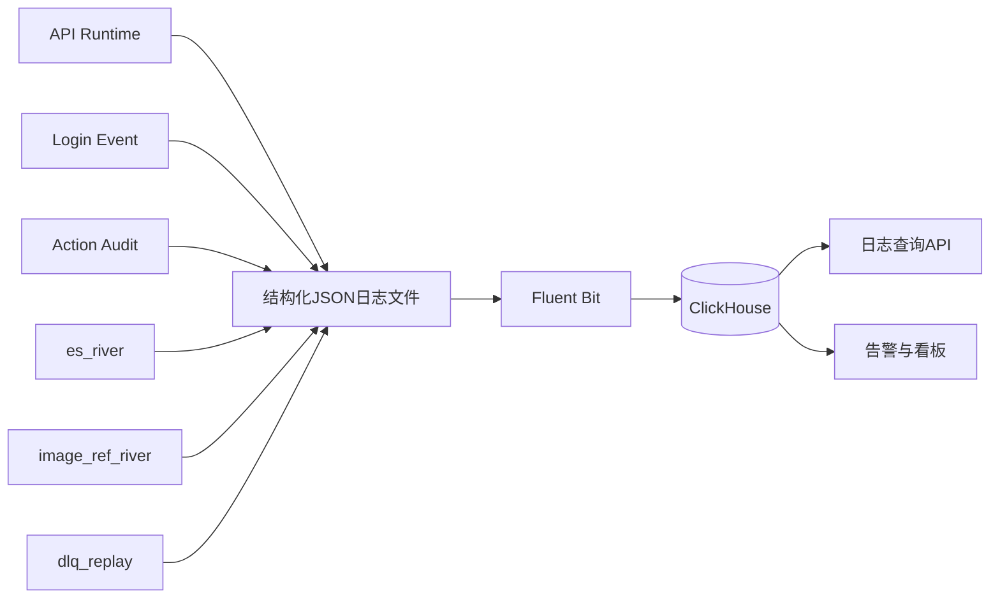

# 全量日志系统改造方案（API + Worker + River + 回放）

## 1. 结论与范围

本方案不再只改 River，而是覆盖整个日志系统：

1. API 请求日志（runtime）
2. 登录事件日志（login_event）
3. 操作审计日志（action_audit）
4. CDC 执行日志（es_river + image_ref_river）
5. DLQ 与回放日志

核心结论：

1. 统一日志标准字段（含 `trace_id/span_id/error.*`）作为全系统基线。
2. River 只是“日志系统中的一个模块”，不是单独体系。
3. 保持现有“应用先写本地 JSON 行文件 -> Fluent Bit -> ClickHouse”的采集模式。
4. CDC 失败处理维持你定的阈值：`max_attempts=2（首次 + 重试1次）`。

## 2. 当前现状（基于仓库）

### 2.1 已有能力

1. 运行日志：`middleware/log_middleware.go` + `core/init_logrus.go`。
2. 登录/审计日志：`service/log_service/write_login_event.go`、`write_action_audit.go`。
3. 查询侧：`service/log_service/query_read.go` 走 ClickHouse。
4. 采集链路：本地 JSON 文件（runtime/login/audit）-> Fluent Bit -> ClickHouse。
5. Worker：`river_service` 与 `image_ref_river_service` 已具备业务执行能力。

### 2.2 关键缺口

1. `trace_id/span_id/parent_span_id` 尚未在 API + Worker + River 统一落地。
2. `error.*` 字段没有形成统一结构（目前以零散字段和文本为主）。
3. River 与回放日志缺少统一字段约束和稳定关联键。
4. CDC 失败闭环尚未完全产品化（DLQ/回放/告警需统一到日志体系）。

## 3. 目标与非目标

### 3.1 目标

1. 单条日志可读，跨模块可串，跨系统可检索。
2. API、Worker、River、回放共用一套字段标准。
3. 错误可聚合（按 `error_code`），链路可定位（trace/span/cdc_job_id）。
4. 不破坏现有日志查询接口能力。

### 3.2 非目标

1. 不在一期强制引入完整 OpenTelemetry 平台。
2. 不在一期改造所有历史日志回填。
3. 不引入 Outbox 作为主日志机制。

## 4. 目标架构

## 5. 统一日志字段标准

日志字段分两层：

1. 通用可观测基线字段（所有日志类型都尽量有）
2. 业务扩展字段（按模块放到固定字段或 `extra_json`）

### 5.1 通用可观测核心字段（固定 12 列）

1. `event_id`：日志行唯一 ID（雪花 ID）。
2. `ts`：事件时间（毫秒精度，统一格式）。
3. `level`：日志级别（debug/info/warn/error）。
4. `trace_id`：全链路 ID（32 hex）；`request_id` 作为展示别名，不单独落列。
5. `span_id`：当前处理段 ID（16 hex，可空）。
6. `parent_span_id`：父段 ID（可空）。
7. `service`：服务名（如 `blogx_server`、`river_worker`）。
8. `env`：运行环境（dev/test/prod）。
9. `instance_id`：实例标识（server_id 或 pod id）。
10. `event_name`：事件名（建议包含模块前缀，如 `river_service.es_projection_failed`）。
11. `error_code`：错误码（如 `ES_429`、`DB_DEADLOCK`，成功时可空）。
12. `error_message`：错误信息（成功时可空）。

### 5.2 扩展字段（`extra_json`）

1. `module`：模块名。示例：`article_api`、`river_service`。用途：细分日志来源模块。
2. `host`：主机名。示例：`api-node-01`。用途：定位单机问题（容器场景可选）。
3. `target_key`：目标对象键。示例：`doc_id=123`、`owner_id=88`。用途：跨链路统一对象检索。
4. `source_table`：源表。示例：`blogx.article_models`。用途：定位 CDC 来源数据表。
5. `error.type`：错误大类。示例：`es_error`、`db_error`。用途：错误归类统计。
6. `error.stack`：错误堆栈。示例：Go stack 字符串。用途：定位代码调用点（仅内网）。
7. `error.cause_chain`：错误因果链。示例：`timeout->retry_exhausted->dlq`。用途：还原失败演进路径。
8. `index`：ES 索引名。示例：`article_index`。用途：定位 ES 投影目标索引。
9. `ref_type`：图片引用类型。示例：`article`、`user`。用途：定位 image_ref 同步范围。
10. `field`：业务字段名。示例：`cover`、`content`。用途：定位哪一字段触发引用更新。
11. 写入原则：仅在需要时写入，避免固定列膨胀。

### 5.3 HTTP/API 扩展字段（runtime/audit）

1. `method`：HTTP 方法。示例：`GET`、`POST`。用途：区分请求类型。
2. `path`：路由路径。示例：`/api/articles`。用途：定位接口入口。
3. `status_code`：响应状态码。示例：`200`、`500`。用途：失败率统计。
4. `latency_ms`：请求耗时（毫秒）。示例：`12`、`2480`。用途：慢请求分析与性能告警。
5. `user_id`：操作者 ID（可空）。示例：`10001`。用途：追踪用户行为。
6. `ip`：客户端 IP。示例：`1.2.3.4`。用途：风控与排障。
7. `request_body`：请求体摘要（脱敏截断后）。用途：审计追溯。
8. `response_body`：响应体摘要（脱敏截断后）。用途：审计追溯。

### 5.4 CDC 扩展字段（River/回放）

1. `cdc_job_id`：CDC 任务唯一键。格式：`{stream}:{schema}.{table}:{binlog_file}:{binlog_pos}:{row_index}`。用途：串联执行、死信、回放。
2. `stream`：链路标识。取值：`es_river` / `image_ref_river`。用途：区分 CDC 流。
3. `source_table`：来源表。示例：`blogx.user_models`。用途：定位触发表。
4. `action`：变更动作。取值：`insert/update/delete`。用途：决定处理策略。
5. `target_key`：目标对象键。示例：ES 用 `doc_id=123`，ImageRef 用 `owner_id=88`。用途：定位受影响对象。
6. `retry_count`：当前重试次数。示例：`0`、`1`。用途：判断是否超过阈值。
7. `result`：执行结果。取值：`success/retry/dlq/replayed`。用途：成功率与失败闭环统计。

字段取舍原则：

1. `binlog_file/binlog_pos` 不再单列，编码在 `cdc_job_id`。
2. `module/host/error.stack/error.cause_chain` 与链路专属细节统一放 `extra_json`。
3. `error_code/error_message` 只有失败场景填充，成功日志不强制带空值。
4. `request_id` 默认等于 `trace_id`，作为展示别名，不再重复落库。

## 6. 日志分类与事件命名

### 6.1 日志分类

1. `runtime`：请求执行、系统运行。
2. `login_event`：登录/登出/刷新令牌。
3. `action_audit`：后台管理操作审计。
4. `cdc_event`：River 执行过程。
5. `replay_event`：DLQ 回放过程。

### 6.2 事件命名规则

1. 统一 snake_case，格式：`<domain>_<action>_<result>`。
2. 示例：`article_create_success`、`es_projection_retry`、`image_ref_replay_failed`。
3. 禁止“含义不清”的泛名（如 `process_ok`、`task_done`）。

## 7. 存储与查询模型

### 7.1 ClickHouse 表策略

保持兼容、渐进演进：

1. 现有三表继续保留：`runtime_logs`、`login_event_logs`、`action_audit_logs`。
2. 新增两表：`cdc_event_logs`、`replay_event_logs`（或先落 `runtime_logs` + `event_name` 兼容过渡）。
3. 新增 `cdc_dead_letter`（MySQL）用于可回放状态管理，不直接替代日志表。

### 7.2 查询能力

1. 支持按 `request_id` / `trace_id` / `cdc_job_id` 三种入口检索。
2. 支持按 `error_code` 聚合失败排行。
3. 支持按 `stream/service/event_name` 维度看趋势。

## 8. 脱敏与合规

1. 默认对 `Authorization/Cookie/Set-Cookie/token/password` 做脱敏。
2. 审计 body 做大小限制（如 8KB）与字段白名单。
3. `error.stack`、`error.cause_chain` 放 `extra_json`，仅内网可见，外部查询默认不返回。
4. 数据保留策略：
   - 热数据（ClickHouse）保留 30-90 天（按业务调整）
   - 冷归档按需导出对象存储

## 9. River 与回放专项（纳入全局日志体系）

### 9.1 双 River 执行与重试

1. `river_service`：ES 投影。
2. `image_ref_river_service`：图片引用关系同步。
3. 两者统一重试阈值：`max_attempts=2（首次 + 重试1次）`。
4. 第二次失败进入 `cdc_dead_letter`，并打 `result=dlq` 日志。

### 9.2 cdc_dead_letter 字段（每个字段解释）

1. `id`：死信记录主键。示例：`1024`。用途：数据库定位与运维排障入口。
2. `stream`：链路来源。示例：`es_river`、`image_ref_river`。用途：按流分桶处理。
3. `cdc_job_id`：CDC 任务唯一键。用途：串联执行日志、死信和回放日志。
4. `source_table`：变更来源表。示例：`blogx.article_models`。用途：定位业务来源。
5. `action`：变更动作。示例：`update`。用途：决定回放动作。
6. `target_key`：受影响对象键。示例：`doc_id=123`。用途：精准回放和排障。
7. `payload_json`：可回放原始负载。用途：保证“可重放”能力。
8. `retry_count`：已重试次数。用途：配合阈值判断是否转死信。
9. `status`：处理状态。取值：`pending/replayed/success/failed`。用途：驱动状态机。
10. `error_code`：机器可读错误码。用途：统计、告警分流。
11. `error_msg`：人类可读错误详情。用途：人工排障。
12. `created_at`：创建时间。用途：积压时长分析。
13. `updated_at`：最后状态变更时间。用途：恢复耗时与卡住检测。

## 10. 配置项建议（新增）

在 `apps/api/config/settings.yaml` 增补：

第一批（必须同步落地）：

1. `log.error.capture_stack`：总开关。`false` 时任何级别都不写 `error.stack`。
2. `log.error.capture_min_level`：最低记录级别。默认 `error`，表示仅 `level >= error` 才允许写 `error.stack`。
3. `log.error.stack_max_bytes`：`error.stack` 最大字节数。默认 `8192`，超过即截断。
4. `log.trace.enabled`：是否注入 `trace_id/span_id/parent_span_id`。建议默认 `true`。
5. `log.trace.request_id_equals_trace_id`：是否让 `request_id` 默认等于最终 `trace_id`。建议默认 `true`。
6. `log.trace.inherit_from_gateway`：是否优先继承网关透传 trace。建议默认 `true`（已定策略）。
7. `log.trace.gateway_header_priority`：网关 trace 头优先级。建议 `traceparent > x-request-id`。
8. `log.error.cause_chain_depth`：`error.cause_chain` 最大展开层数。建议 `3~5`。
9. `river.retry.max_attempts`：`river_service` 最大尝试次数（包含首次）。建议固定 `2`。
10. `river.retry.delay_ms`：`river_service` 固定重试间隔毫秒。建议 `200`。
11. `image_ref_river.retry.max_attempts`：`image_ref_river_service` 最大尝试次数。建议固定 `2`。
12. `image_ref_river.retry.delay_ms`：`image_ref_river_service` 固定重试间隔毫秒。建议 `200`。
13. `replay.batch_size`：DLQ 回放单批条数。建议 `50~200`，按压测调整。

这 13 项的执行规则（方案约束）：

1. 先判断总开关：关闭则直接丢弃 `error.stack`。
2. 再判断级别闸门：`level < capture_min_level` 时丢弃 `error.stack`。
3. 通过闸门后再做长度控制：超过 `stack_max_bytes` 则截断，可附带 `error_stack_truncated=true` 标记。
4. 处理 `trace_id` 时执行“继承优先”：按 `gateway_header_priority` 顺序读取网关头，命中则继承；未命中时本地生成。
5. 当 `request_id_equals_trace_id=true` 时，`request_id` 使用最终 `trace_id` 作为展示别名。
6. `error.cause_chain` 生成时按 `cause_chain_depth` 截断，超层不继续展开。
7. `river_service` 重试使用固定间隔：`max_attempts=2` 且 `delay_ms=200`。
8. `image_ref_river_service` 重试使用固定间隔：`max_attempts=2` 且 `delay_ms=200`。
9. DLQ 回放批次由 `replay.batch_size` 控制，默认建议 `100`。

## 11. 风险与决策点

1. `trace_id` 采用“继承优先”策略：优先使用网关透传值；网关未透传时由服务本地生成。`request_id` 默认等于最终 `trace_id`（展示别名）。
2. `error.stack` 全量记录会增大日志体积，生产建议按错误级别与采样开关控制。
3. 如果后续 River 拆成独立项目，必须保留同一字段规范和 `cdc_job_id` 规则，否则链路会断。

## 12. 分阶段实施（全系统）

### 阶段 L1：字段规范落地（先统一口径）

1. 在 log_service 增加通用字段组装器（含 trace/span/error）。
2. API runtime/login/audit 接入统一字段。
3. River/回放日志接入 `cdc_job_id + stream + result`。
4. 加入 `error.stack` 三道闸门：`capture_stack`、`capture_min_level`、`stack_max_bytes`。
5. 接入 `error.cause_chain_depth`，保证 `error.cause_chain` 可控展开。

DoD：

1. 任意一类日志都能查到核心 12 字段中的关键列（至少 `event_id/trace_id/service/event_name`）。
2. 请求链路可用 `request_id（trace_id 别名）` 串起来。
3. `warn/info` 默认不写 `error.stack`；`error` 级别写栈且 obey `stack_max_bytes`。
4. 网关透传 `traceparent` 或 `x-request-id` 时，`trace_id` 采用继承值；无透传时本地生成。
5. `error.cause_chain` 输出层数 obey `cause_chain_depth`。

### 阶段 L2：River 可靠性与死信闭环

1. 修复 ES bulk `errors=true` 语义。
2. 双 River 都实现“固定间隔重试：`max_attempts=2`、`delay_ms=200`，仍失败入 DLQ”。
3. 增加 `cdc_dead_letter` repository/service。

DoD：

1. 注入故障后，第二次失败能稳定写入 `cdc_dead_letter`。
2. 日志有 `error_code/error_message/result=dlq`。
3. 双 River 重试行为与配置一致（不出现指数退避）。

### 阶段 L3：回放与告警

1. 增加 replay worker（按 stream 分流），并按 `replay.batch_size` 分批回放。
2. 告警规则：`cdc_dlq_pending_count`、连续失败、回放失败率。

DoD：

1. 可以从死信到回放形成闭环。
2. 看板可见每条 stream 的积压与恢复时间。
3. 调整 `replay.batch_size` 后回放吞吐和失败率可观测、可回归。

### 阶段 L4：查询与权限

1. 查询 API 支持 `trace_id/cdc_job_id/error_code`。
2. 对 `extra_json` 中的 `error.stack`、审计原文做权限隔离。

DoD：

1. 管理台可完成“一键追链路”（API -> River -> 回放）。
